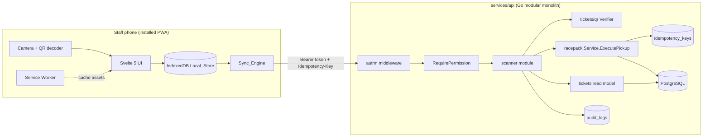
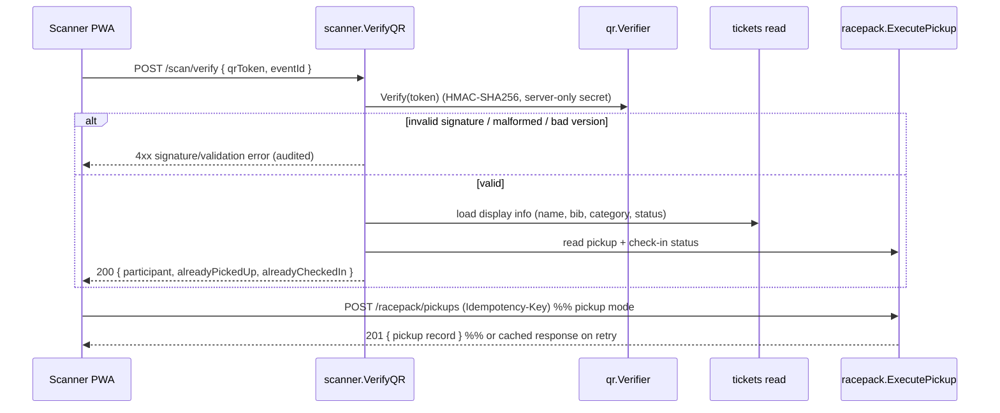
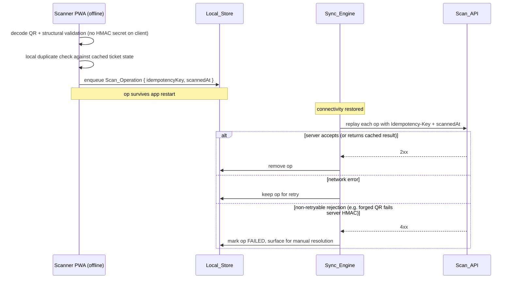

# Design Document — Scanner PWA (Phase 15)

## Overview

The Scanner PWA delivers an installable, offline-capable app for on-site staff
to process participants during racepack distribution and event check-in. It is
built on two pillars that already exist in the platform and are reused rather
than reinvented:

- **Phase 7 `tickets/qr`** — HMAC-SHA256 signed QR tokens
  (`<version>.<base64url(payload)>.<base64url(hmac)>`, carrying only
  `ticket_id`, `event_id`, `version`). The `qr.Signer.Verify` function is the
  authoritative signature check. The verify/scan endpoint was deferred to this
  phase.
- **Phase 14/14.1 `racepack`** — `Service.ExecutePickup` provides a TOCTOU-safe
  pickup with `Idempotency-Key` support, slot enforcement, and the unique
  partial index `uniq_racepack_pickup_records_ticket_active` that guarantees at
  most one `PICKED_UP` record per ticket.

The design adds a **new backend module `internal/modules/scanner`** that
composes these building blocks behind a small, scanner-focused API surface
(verify, check-in), plus a **new frontend app `apps/scanner`** (Vite + Svelte 5
PWA) that decodes QR codes, shows participant info, confirms pickups/check-ins,
and keeps working offline through a persistent local queue synced with
exactly-once semantics.

The guiding constraint throughout is the constitution's rule: **correctness and
no-duplicates over speed**, and **never expose secrets to the frontend**. The
HMAC signing secret (`TICKET_QR_SECRET`) stays server-only; the server is the
single source of truth for signature validation and for the no-duplicate
guarantee.

### Design Goals

1. Reuse `racepack.ExecutePickup` verbatim for pickups so the existing
   TOCTOU + unique-index + idempotency guarantees carry over unchanged.
2. Add a dedicated, idempotent check-in path (`VALID → USED`) that reuses the
   platform `idempotency_keys` mechanism.
3. Keep the QR HMAC secret server-only; server-side verification is
   authoritative. Offline scanning is provisional and reconciled at sync.
4. Guarantee exactly-once server writes regardless of retries, offline
   replays, or network flakiness.
5. Audit every scan, pickup, and check-in — including offline-synced
   operations, which carry the original scan timestamp.

### Scope Boundaries (What This Design Does NOT Cover)

- Proxy pickups and problem-desk cases (already delivered in Phase 14; the
  scanner links out to them but does not redesign them).
- BIB assignment (Phase 13) and ticket issuance (Phase 7).
- Organizer dashboard reporting (Phase 14 `GetDashboard`).

## Architecture

### System Context



### Request Flow — Online Scan → Confirm



### Request Flow — Offline Scan → Deferred Sync



### Module Placement

The backend gets a new module at `services/api/internal/modules/scanner`
following the standard module layout (`handler.go`, `service.go`, `dto.go`,
`routes.go`, `errors.go`, `model.go`, `tests/`). It owns **no new hot-path
tables**; it composes:

- `tickets/qr.Signer.Verify` for signature validation.
- A read surface over `tickets` (holder name, BIB, category, status) — accessed
  through an injected read interface, honoring "no cross-module DB access; use
  services as boundaries."
- `racepack.Service.ExecutePickup` for pickups (unchanged).
- Its own `CheckIn` service method for the `VALID → USED` transition, reusing
  the platform `idempotency_keys` table and the `audit.Logger`.

Rationale for a separate module rather than growing `racepack`: check-in is a
ticket-lifecycle concern (`tickets.status`), not a racepack concern, and the
scan/verify endpoint spans both tickets and racepack. A thin composing module
keeps each domain's boundaries clean.

### Frontend App Architecture (`apps/scanner`)

Per the Scanner Constitution the app is **Vite + Svelte 5 + PWA** — no Astro,
React, Next, Vue, or SvelteKit. Layers:

| Layer | Responsibility | Key tech |
|-------|----------------|----------|
| UI (`.svelte`) | Login, event picker, camera view, participant card, confirm, queue status | Svelte 5 runes (`$state`, `$derived`, `$effect`) |
| `lib/qr.ts` | Decode camera frames → token string; structural validation | camera decode library (see below) |
| `lib/api.ts` | Typed fetch wrapper (Bearer token, `Idempotency-Key`) | `fetch` |
| `lib/offline-db.ts` | IndexedDB access for Offline_Queue + cached ticket state | `idb` |
| `lib/sync.ts` | Sync_Engine: drain queue, retry, failed-state handling | Background Sync API + fallback |
| `pwa/` | manifest + service worker (asset precache, offline shell) | `vite-plugin-pwa` (Workbox) |

**Camera QR decode library choice:** use **`qr-scanner`** (Nimiq). Rationale:
tiny (~15 KB), uses the native `BarcodeDetector` API when available (fast on
modern Android Chrome) and falls back to a bundled WebAssembly/worker decoder,
runs decoding off the main thread, and has no framework coupling. Alternative
considered: `@zxing/browser` (heavier, more formats than we need). We only need
QR, so `qr-scanner` is the leaner fit for a fast scan-to-confirm cycle
(Requirement 9.4).

**Svelte 5 runes + mandatory cleanup:** the camera view owns a `MediaStream`
and a decode loop; both MUST be torn down when the component unmounts or the
scanning mode changes:

```svelte
<script lang="ts">
  import QrScanner from 'qr-scanner';
  let videoEl: HTMLVideoElement;
  let lastToken = $state<string | null>(null);

  $effect(() => {
    const scanner = new QrScanner(videoEl, (r) => { lastToken = r.data; }, {
      highlightScanRegion: true,
    });
    scanner.start();
    // Mandatory cleanup — stops the camera track and decode loop.
    return () => { scanner.stop(); scanner.destroy(); };
  });
</script>
<video bind:this={videoEl}></video>
```

**Service worker / installability:** `vite-plugin-pwa` generates the manifest
(name, icons, `display: standalone`, `start_url`) and a Workbox service worker
that precaches the app shell and static assets, so a launched-from-home-screen
scanner loads its UI with zero network (Requirement 9.1, 9.2). Background sync
is registered so the browser can flush the queue when connectivity returns even
if the app is backgrounded; a foreground fallback listens to `online`/`offline`
events and a periodic timer.

## Components and Interfaces

### Backend: `scanner` module

#### `Service` (composition root)

```go
// Service composes QR verification, ticket reads, racepack pickups, and the
// check-in transition. It owns no tables of its own except the shared
// idempotency_keys / audit_logs via injected collaborators.
type Service struct {
    qr        QRVerifier        // tickets/qr.Signer
    tickets   TicketReader      // read model over tickets (name, bib, category, status)
    racepack  PickupExecutor    // racepack.Service (ExecutePickup, GetPickupStatusByTicket)
    repo      Repository        // ticket status transition + idempotency + membership
    audit     AuditRecorder     // platform audit.Logger (may be nil)
    log       *slog.Logger
}

type QRVerifier interface {
    Verify(token string) (qr.TicketRef, error)
}

type TicketReader interface {
    // GetDisplayInfo returns non-sensitive participant display fields.
    GetDisplayInfo(ctx context.Context, ticketID uuid.UUID) (DisplayInfo, error)
}

type PickupExecutor interface {
    GetPickupStatusByTicket(ctx context.Context, ticketID uuid.UUID) (db.RacepackPickupRecord, error)
}
```

#### Verify

```go
// VerifyInput is the decoded token plus the selected event.
type VerifyInput struct {
    Token   string
    EventID uuid.UUID   // the Permitted_Event the staff selected
    OrgID   uuid.UUID
    StaffID uuid.UUID
}

// Verify validates the QR signature (authoritative HMAC), confirms the ticket
// belongs to the selected event, and returns non-sensitive display info plus
// duplicate flags. Rejected signatures are audited (Req 10.4).
func (s *Service) Verify(ctx context.Context, in VerifyInput) (VerifyResult, error)
```

Steps:
1. `qr.Verify(token)` → `TicketRef` or reject (`ErrSignatureInvalid` /
   `ErrMalformedToken` / `ErrUnsupportedVersion`). On reject during an online
   scan, write a `SCANNER_QR_REJECTED` audit entry.
2. Assert `ref.EventID == in.EventID`; else `ErrEventMismatch`.
3. Load `DisplayInfo` (name, BIB, category, ticket status).
4. Compute `alreadyPickedUp` from `racepack.GetPickupStatusByTicket` and
   `alreadyCheckedIn` from ticket status `== USED`, including the original
   pickup/check-in timestamp for the Duplicate_Warning (Req 6.4).

#### Check-In

```go
type CheckInInput struct {
    OrgID     uuid.UUID
    EventID   uuid.UUID
    TicketID  uuid.UUID
    StaffID   uuid.UUID
    ScannedAt *time.Time // original offline scan time; nil = server now()
}

// CheckIn transitions a VALID ticket to USED atomically and idempotently.
// Mirrors ExecutePickup's structure: lock row, re-check, transition, audit.
func (s *Service) CheckIn(ctx context.Context, in CheckInInput) (CheckInResult, error)
```

Steps inside one transaction:
1. `SELECT ... FOR UPDATE` the ticket row (closes the TOCTOU window, same
   pattern as `ExecutePickup`).
2. If `status == CANCELLED` → `ErrTicketCancelled`.
3. If `ref.EventID != in.EventID` → `ErrEventMismatch`.
4. If `status == USED` → treat as **duplicate**: do NOT transition again;
   return the existing `used_at` so the UI shows a Duplicate_Warning
   (Req 6.2, 6.3).
5. If `status == VALID` → `UPDATE tickets SET status='USED', used_at=$ts`.
6. Audit `SCANNER_CHECKIN_COMPLETED` outside the tx (metadata `at` =
   `ScannedAt` when provided, else server time — Req 10.2, 10.3).

Idempotency wraps this at the handler using the existing
`LookupIdempotency`/`StoreIdempotency` helpers with scope
`"scanner.checkin"`. The `USED`-is-a-no-op rule makes check-in naturally
idempotent even without a stored key; the key additionally returns the
**identical response body** on replay (Req 8.3).

#### HTTP Endpoints

Mounted under the existing org/event group in `server.go`
(`/api/v1/organizations/{orgId}/events/{eventId}`), consistent with racepack:

| Method | Path | Permission | Purpose | Req |
|--------|------|-----------|---------|-----|
| `POST` | `/scan/verify` | `racepack.execute` OR `checkin.execute` | Validate QR, return display info + duplicate flags | 2, 3, 6 |
| `POST` | `/scan/check-in` | `checkin.execute` | Idempotent `VALID → USED` | 5, 6, 8, 10 |
| `POST` | `/racepack/pickups` (existing) | `racepack.execute` | Idempotent pickup (reused as-is) | 4, 6, 8, 10 |
| `GET`  | `/scan/events` (or reuse existing event listing) | membership | Permitted_Events for the staff | 1 |

`/scan/verify` accepts either permission because both pickup and check-in staff
must be able to read participant info before confirming.

Route registration follows the racepack pattern:

```go
func (h *Handler) RegisterEventRoutes(r chi.Router, loader middleware.PermissionLoader) {
    r.Route("/scan", func(r chi.Router) {
        r.With(middleware.RequireAnyPermission(loader, "racepack.execute", "checkin.execute")).
            Post("/verify", h.Verify)
        r.With(middleware.RequirePermission(loader, "checkin.execute")).
            Post("/check-in", h.CheckIn)
    })
}
```

> Note: `RequireAnyPermission` is a small additive helper alongside the
> existing `RequirePermission`; if adding it is undesirable, `/scan/verify` can
> be split so each permission mounts its own copy. The design prefers the
> helper for a single endpoint.

Permitted_Events (Requirement 1.2/1.4) are resolved by filtering the staff's
org memberships to events where they hold `racepack.execute` or
`checkin.execute`, reusing the existing RBAC loader and event listing rather
than a new query where possible.

### Frontend: `apps/scanner` components

| Component | Responsibility | Runes / cleanup |
|-----------|----------------|-----------------|
| `Login.svelte` | Credentials → session token in Local_Store (Req 1.1, 1.6) | `$state` for form |
| `EventPicker.svelte` | List Permitted_Events, select scanning event (Req 1.2, 1.4) | `$state`, `$derived` |
| `ModeToggle.svelte` | Pickup vs Check-In mode (Req 5.4) | `$state` |
| `ScannerCamera.svelte` | Camera stream + QR decode | `$effect` cleanup stops `MediaStream` + scanner |
| `ParticipantCard.svelte` | Name, BIB, category, status, duplicate flags (Req 3, 6) | `$derived` from verify result |
| `ConfirmAction.svelte` | Confirm pickup or check-in; success feedback (Req 4.5, 5.3) | `$state` |
| `OfflineSyncStatus.svelte` | Online/offline badge + pending count (Req 7.5) | `$effect` subscribes to sync store, cleans up |

`lib/sync.ts` exposes a small store the status component reads:

```ts
interface SyncState {
  online: boolean;
  pending: number;   // Offline_Queue length (Req 7.5)
  failed: ScanOperation[]; // non-retryable, need manual resolution (Req 8.6)
}
```

## Data Models

### QR Token (unchanged — Phase 7)

```
<version>.<base64url(payload)>.<base64url(hmac-sha256)>
payload = { "tid": <ticket uuid>, "eid": <event uuid>, "v": 1 }
```

`qr.TicketRef{ TicketID, EventID, Version }` is the decoded result. The HMAC
secret comes from `TICKET_QR_SECRET` and never leaves the server.

### Server response DTOs (`scanner/dto.go`)

```go
// DisplayInfo — strictly non-sensitive fields (Req 3.4: no card data,
// passwords, or full contact details).
type DisplayInfo struct {
    ParticipantName string `json:"participantName"`
    BibNumber       string `json:"bibNumber"`   // "" when unassigned
    CategoryName    string `json:"category"`
    TicketStatus    string `json:"ticketStatus"` // VALID | USED | CANCELLED
}

type VerifyResult struct {
    TicketID         string     `json:"ticketId"`
    EventID          string     `json:"eventId"`
    Display          DisplayInfo `json:"display"`
    AlreadyPickedUp  bool       `json:"alreadyPickedUp"`
    PickedUpAt       *time.Time `json:"pickedUpAt,omitempty"`   // Req 6.4
    AlreadyCheckedIn bool       `json:"alreadyCheckedIn"`
    CheckedInAt      *time.Time `json:"checkedInAt,omitempty"`  // Req 6.4
}

type CheckInRequest struct {
    TicketID  string     `json:"ticketId"`
    ScannedAt *time.Time `json:"scannedAt,omitempty"` // original offline scan time
}

type CheckInResult struct {
    TicketID   string    `json:"ticketId"`
    Status     string    `json:"status"`    // USED
    CheckedInAt time.Time `json:"checkedInAt"`
    Duplicate  bool      `json:"duplicate"` // true when it was already USED
}
```

### Client: Offline_Queue (IndexedDB via `idb`)

```ts
type ScanKind = 'PICKUP' | 'CHECKIN';
type OpStatus = 'PENDING' | 'SYNCING' | 'FAILED';

interface ScanOperation {
  idempotencyKey: string; // client-generated UUID v4 (Req 8.2)
  kind: ScanKind;
  eventId: string;
  ticketId: string;       // decoded from the token, structurally validated
  qrToken: string;        // raw token; server re-verifies HMAC at sync
  counterId?: string;     // pickups
  slotId?: string;        // pickups (optional)
  scannedAt: string;      // ISO8601 original scan time (Req 10.3)
  status: OpStatus;
  attempts: number;
  lastError?: string;
}

interface CachedTicketState {
  ticketId: string;
  eventId: string;
  pickedUp: boolean;      // for offline duplicate detection (Req 7.4)
  checkedIn: boolean;
  updatedAt: string;
}
```

Two object stores: `operations` (keyPath `idempotencyKey`) and
`ticketState` (keyPath `ticketId`). Both persist across restarts (Req 7.3,
7.6). On startup the app reads all non-`FAILED` operations back into the
in-memory queue (Req 7.6).

### Database

No new hot-path tables. Reuses:

- `tickets` — `status` (`VALID`/`USED`/`CANCELLED`), `used_at`.
- `racepack_pickup_records` — plus its `uniq_racepack_pickup_records_ticket_active`
  unique partial index.
- `idempotency_keys` — new scopes `"scanner.checkin"` (pickups keep
  `"racepack.execute_pickup"`).
- `audit_logs` — new actions `SCANNER_CHECKIN_COMPLETED`, `SCANNER_QR_REJECTED`
  (pickups keep `RACEPACK_PICKUP_COMPLETED`).

**Migration `00053_seed_checkin_rbac`** (reversible up/down, next after 00052)
adds the `checkin.execute` permission and grants it, mirroring
`00051_extend_racepack_rbac`:

```sql
-- +goose Up
INSERT INTO permissions (key, description) VALUES
    ('checkin.execute', 'Check a participant in at event entry (VALID -> USED)')
ON CONFLICT (key) DO NOTHING;

INSERT INTO role_permissions (role_id, permission_id)
SELECT r.id, p.id FROM roles r, permissions p
WHERE r.organization_id IS NULL
  AND r.slug IN ('racepack-staff', 'manager')
  AND p.key = 'checkin.execute'
ON CONFLICT DO NOTHING;

-- +goose Down
DELETE FROM role_permissions WHERE permission_id IN
    (SELECT id FROM permissions WHERE key = 'checkin.execute');
DELETE FROM permissions WHERE key = 'checkin.execute';
```

A new SQLC query `MarkTicketUsed` (in `database/queries/`) performs the
guarded transition and `LockTicketForUpdate` is reused for the row lock:

```sql
-- name: MarkTicketUsed :one
UPDATE tickets SET status = 'USED', used_at = COALESCE(sqlc.narg('used_at'), now())
WHERE id = $1 AND status = 'VALID'
RETURNING *;
```

## Key Design Decisions

### D1 — Offline QR validation without exposing the HMAC secret

**Decision:** Server-side HMAC verification is the single authoritative
signature check. Offline, the scanner performs **structural validation only**
(three dot-separated segments, supported `version`, base64url-decodable
payload, parseable `ticket_id`/`event_id`, and `event_id` matches the selected
Permitted_Event) and enqueues the operation as **provisional**. The raw token
is stored with the queued op; at sync the server re-runs `qr.Verify` (HMAC).
A forged or tampered token that passes structural checks but fails the HMAC is
**rejected at sync** and surfaced as a FAILED op for manual resolution
(Req 8.6, 2.3).

**Why not ship a verification key to the client?** The current QR scheme is
**symmetric HMAC-SHA256** — the only key that can verify a token is the same
secret that signs it. Shipping it to the client would violate the constitution
("Never expose secrets to frontend") and let a compromised device forge valid
tickets. So we do not, and cannot safely, do offline cryptographic
verification under the existing scheme.

**Reconciling Requirement 7.1 ("cached verification key"):** what the scanner
caches for offline use is a **verification descriptor** — the supported schema
`version`(s), the expected token structure, and the selected event's public
`event_id` — which is the strongest offline check possible without a secret.
This is honest about the symmetric-key reality: offline acceptance is
provisional, and the authoritative signature gate remains server-side at sync.

**Tradeoff:** a forged token could momentarily display as "queued" and staff
could hand out a racepack before the sync rejection arrives. This is accepted
because (a) **server records stay correct** — no forged pickup/check-in is ever
persisted, and (b) the failed op is surfaced for manual follow-up. Correctness
of the system of record is never compromised; only a transient physical
hand-off risk remains, which is inherent to any offline mode.

**Future option (documented, not in scope):** introduce an **Ed25519**
signature as QR schema **v2**. The server holds the private key; the scanner
caches the **public** key (not a secret) and performs real offline signature
verification. This requires re-issuing/dual-signing tokens and key management,
so it is deferred. The provisional-plus-server-authoritative model is the
correct Phase 15 choice.

### D2 — Dedicated idempotent Check-In endpoint

Check-in is a **ticket-lifecycle** transition (`VALID → USED`), distinct from
racepack pickup (a `racepack_pickup_records` insert). A separate
`POST /scan/check-in` reuses the platform `idempotency_keys` mechanism (scope
`"scanner.checkin"`) via the same `LookupIdempotency`/`HashRequest`/
`StoreIdempotency` helpers already used by pickups. Idempotency is
double-guarded: the `USED`-is-a-no-op rule makes replays safe even without a
key, and the stored key returns the identical response body on retries.

### D3 — Reuse `racepack.ExecutePickup` for pickup sync

Offline pickup ops are replayed to the **existing** `POST /racepack/pickups`
endpoint with their `Idempotency-Key`. This inherits, unchanged:
`SELECT ... FOR UPDATE` (TOCTOU), the `uniq_racepack_pickup_records_ticket_active`
unique index (no duplicate `PICKED_UP`), slot enforcement, and cached-response
idempotency. No new pickup logic is written for the scanner.

### D4 — RBAC: separate `checkin.execute` permission

**Decision:** pickups keep `racepack.execute`; check-in gets a **new
`checkin.execute`** permission.

**Justification:** racepack distribution (often days before the event) and gate
check-in (race morning) are frequently staffed by **different people**. A
separate permission lets an organizer grant one capability without the other
(least privilege). Seeding grants both to `manager` and to the existing
`racepack-staff` role so current staff keep working, while orgs that want to
split duties can create a check-in-only role. `/scan/verify` accepts **either**
permission because both roles must read participant info before confirming.

### D5 — Audit including offline-synced original timestamps

Pickups are already audited by `ExecutePickup` (`RACEPACK_PICKUP_COMPLETED`).
The scanner adds `SCANNER_CHECKIN_COMPLETED` and, on online signature rejection,
`SCANNER_QR_REJECTED` (Req 10.4). For offline-synced ops, the sync request
carries `scannedAt` (the original scan time); the audit entry records
`at = scannedAt` (Req 10.3), and `CheckIn` sets `used_at = scannedAt` when
provided. Online scans default to server `now()`. Audit writes are best-effort
and never roll back the user-facing action, consistent with `audit.Logger`.

## Correctness Properties

*A property is a characteristic or behavior that should hold true across all
valid executions of a system — essentially, a formal statement about what the
system should do. Properties serve as the bridge between human-readable
specifications and machine-verifiable correctness guarantees.*

These properties were derived from the acceptance-criteria prework. Criteria
that are pure UI feedback (1.1, 1.3, 1.6, 4.5, 5.3, 5.4), hardware/decode
integration (2.1), PWA setup (9.1), or performance (9.3, 9.4) are validated by
example, integration, smoke, or manual tests instead (see Testing Strategy) and
are intentionally not expressed as universal properties.

### Property 1: QR verification round-trip

*For any* pair of `ticket_id` and `event_id`, verifying the token produced by
signing them returns a `TicketRef` whose `ticket_id` and `event_id` equal the
originals.

**Validates: Requirements 2.2**

### Property 2: Tampered, malformed, or unsupported tokens are rejected without side effects

*For any* validly signed token, any mutation of its payload or signature
segment, any structurally malformed string, and any unsupported version SHALL
cause verification to return an error; and *for any* rejected token no pickup
record and no ticket-status transition SHALL be produced.

**Validates: Requirements 2.3, 2.4, 2.6**

### Property 3: Event-mismatch rejection

*For any* token whose embedded `event_id` differs from the selected
Permitted_Event, the scan operation SHALL be rejected with an event-mismatch
error.

**Validates: Requirements 2.5**

### Property 4: Operations are authorized only for permitted events

*For any* set of events and staff permission assignments, the set of events
returned to the staff SHALL be exactly those for which the staff holds
`racepack.execute` or `checkin.execute`; and *for any* scan operation whose
target event is not permitted for the staff, the operation SHALL be rejected
with an authorization error.

**Validates: Requirements 1.2, 1.4, 1.5**

### Property 5: Display information completeness

*For any* validated ticket, the verify result SHALL include the participant
name, BIB number, category, and current ticket status sourced from that ticket.

**Validates: Requirements 3.1**

### Property 6: No sensitive data in display

*For any* validated ticket, the serialized verify result SHALL contain only
whitelisted display fields (name, BIB, category, ticket status, duplicate
flags/timestamps) and SHALL NOT contain payment card data, passwords, or full
contact details.

**Validates: Requirements 3.4**

### Property 7: Duplicate flags and original timestamps

*For any* ticket, the verify result's `alreadyPickedUp` SHALL be true exactly
when an active `PICKED_UP` record exists (returning that record's timestamp),
and `alreadyCheckedIn` SHALL be true exactly when the ticket status is `USED`
(returning the check-in timestamp).

**Validates: Requirements 3.2, 3.3, 6.1, 6.4**

### Property 8: Pickup eligibility enforcement

*For any* ticket that is `CANCELLED`, has no assigned BIB, or whose order is not
`PAID`, confirming a racepack pickup SHALL be rejected with the corresponding
error and SHALL NOT create a pickup record.

**Validates: Requirements 4.2, 4.3, 4.4**

### Property 9: Pickup creates exactly one record

*For any* eligible ticket, any number of pickup confirmations (including
concurrent and retried attempts) SHALL result in exactly one `PICKED_UP` record
for that ticket.

**Validates: Requirements 4.1, 6.3**

### Property 10: Check-in transition and idempotence

*For any* ticket, confirming a check-in SHALL transition it from `VALID` to
`USED` at most once: a `VALID` ticket becomes `USED` with a check-in timestamp,
a `CANCELLED` ticket is rejected with no transition, and an already-`USED`
ticket returns a duplicate result with no further transition.

**Validates: Requirements 5.1, 5.2, 6.2, 6.3**

### Property 11: Server idempotency is exactly-once

*For any* scan operation replayed any number of times with the same
Idempotency-Key, the Scan_API SHALL apply the effect exactly once and return the
identical original response for every subsequent replay.

**Validates: Requirements 8.3**

### Property 12: Offline structural validation

*For any* decoded token string, offline structural validation SHALL accept it
if and only if it has the correct segment structure, a supported version, a
base64url-decodable payload with parseable `ticket_id`/`event_id`, and an
`event_id` matching the selected Permitted_Event; accepted tokens SHALL be
enqueued and rejected tokens SHALL NOT be enqueued.

**Validates: Requirements 7.1**

### Property 13: Unique idempotency key per queued operation

*For any* sequence of enqueued Scan_Operations, all assigned Idempotency-Keys
SHALL be pairwise distinct.

**Validates: Requirements 7.2**

### Property 14: Offline queue persistence round-trip

*For any* set of enqueued Scan_Operations, persisting them to Local_Store and
then restoring after an application restart SHALL yield a queue equal to the
original set of unsynchronised operations.

**Validates: Requirements 7.3, 7.6**

### Property 15: Offline duplicate detection against cached state

*For any* ticket already recorded as processed in the cached ticket state,
scanning it again while offline SHALL surface a Duplicate_Warning and SHALL NOT
enqueue a second operation for the same action.

**Validates: Requirements 7.4**

### Property 16: Pending count reflects the queue

*For any* queue state, the displayed pending count SHALL equal the number of
operations in the `PENDING` state.

**Validates: Requirements 7.5**

### Property 17: Sync engine transmits, retains, and fails correctly

*For any* queue of pending operations: with a succeeding transport every
operation SHALL be transmitted exactly once (each carrying its Idempotency-Key)
and then removed from the queue and Local_Store; with a network-error transport
every operation SHALL remain `PENDING` for retry; and with a non-retryable
rejection transport every operation SHALL move to `FAILED` and be surfaced for
manual resolution.

**Validates: Requirements 8.1, 8.2, 8.4, 8.5, 8.6**

### Property 18: Audit content completeness

*For any* recorded pickup or check-in, an audit entry SHALL be written
containing the ticket identifier, the staff identifier, and a timestamp.

**Validates: Requirements 10.1, 10.2**

### Property 19: Offline-synced audit uses the original scan timestamp

*For any* offline-synced operation carrying an original `scannedAt` value, the
resulting audit entry's timestamp SHALL equal that original scan time rather
than the sync time.

**Validates: Requirements 10.3**

## Error Handling

### Backend error taxonomy

The scanner module defines typed sentinel errors (`scanner/errors.go`) and maps
them to stable error codes in the platform error envelope
(`{ "error": { "code", "message", "requestId" } }`), mirroring the racepack
handler's `writeError` switch. Raw internal errors are never leaked
(constitution rule).

| Sentinel | HTTP | Code | Retryable at sync? |
|----------|------|------|--------------------|
| `ErrSignatureInvalid` | 422 | `QR_SIGNATURE_INVALID` | No → FAILED |
| `ErrMalformedToken` | 400 | `QR_MALFORMED` | No → FAILED |
| `ErrUnsupportedVersion` | 422 | `QR_UNSUPPORTED_VERSION` | No → FAILED |
| `ErrEventMismatch` | 404 | `EVENT_MISMATCH` | No → FAILED |
| `ErrTicketNotFound` | 404 | `TICKET_NOT_FOUND` | No → FAILED |
| `ErrTicketCancelled` | 409 | `TICKET_CANCELLED` | No → FAILED |
| `ErrAlreadyCheckedIn` | 409 | `ALREADY_CHECKED_IN` | No (treated as duplicate success) |
| `ErrAlreadyPickedUp` (racepack) | 409 | `ALREADY_PICKED_UP` | No (duplicate success) |
| `ErrBibMissing` / `ErrOrderNotPaid` (racepack) | 409 | `BIB_MISSING` / `ORDER_NOT_PAID` | No → FAILED |
| `ErrIdempotencyConflict` | 409 | `IDEMPOTENCY_CONFLICT` | No |
| `ErrUnauthorizedEvent` | 403 | `FORBIDDEN_EVENT` | No → FAILED |
| (network / 5xx / timeout) | — | — | **Yes → retain PENDING** |

The Sync_Engine classifies responses: `2xx` (including cached idempotent
responses) → drain; `409 ALREADY_*` → drain as a resolved duplicate; network
error / `5xx` / timeout → keep `PENDING`; other `4xx` → `FAILED` and surface
(Req 8.5, 8.6).

### Concurrency and TOCTOU

Both pickups (existing) and check-ins (new) lock the ticket row with
`SELECT ... FOR UPDATE` inside a transaction, re-check eligibility on the locked
row, and rely on database-level guarantees (unique partial index for pickups;
the `status='VALID'` guard in `MarkTicketUsed` for check-ins). This makes the
exactly-once properties (9, 10, 11) hold under concurrent scans of the same
ticket from multiple devices.

### Client error handling

- **Camera/permission denied:** surface a clear message; the app remains usable
  for reviewing/queuing is blocked until camera access is granted.
- **Decode failure:** keep scanning; no operation is created.
- **Offline forged/tampered token:** accepted provisionally per D1; the failed
  server verification at sync moves the op to `FAILED` with the server's
  message shown for manual resolution.
- **Storage quota / IndexedDB failure:** block new enqueues and warn the staff
  rather than silently dropping operations (never lose a scan).

## Testing Strategy

### Dual approach

- **Property-based tests** validate the universal properties above across many
  generated inputs.
- **Unit tests** cover specific examples, edge cases, and error conditions.
- **Integration tests** cover PWA/service-worker behavior, camera decode, and
  end-to-end online/offline flows.

### Property-based testing

PBT **is applicable** to this feature's pure logic: QR sign/verify, structural
validation, offline-queue dedup and persistence, idempotency exactly-once, the
check-in transition, and audit content. Configuration:

- **Backend (Go):** use a property-testing library for Go
  (`pgregory.net/rapid` or `testing/quick`); do not hand-roll generators for
  the core loop. Properties 1–3, 5–11, 18–19 run here. DB-backed properties
  (9, 10, 11, 18, 19) use a real test Postgres (as the existing racepack
  integration tests do) or transaction-scoped fixtures; external collaborators
  are otherwise real since the logic is what's under test.
- **Frontend (TypeScript):** use `fast-check` with Vitest. Properties 4, 12–17
  run here. IndexedDB is exercised via `fake-indexeddb`; the sync transport
  (Property 17) uses an injectable mock transport so no real network is needed.
- **Minimum 100 iterations** per property test.
- Each property test is tagged with a comment referencing its design property:
  `// Feature: scanner-pwa, Property {n}: {property text}`.
- Each correctness property is implemented by a **single** property-based test.

### Unit / example tests

- Login success stores token; invalid credentials rejected; logout clears token
  (1.1, 1.3, 1.6).
- Pickup and check-in success confirmations; mode toggle presents the correct
  action (4.5, 5.3, 5.4).
- Invalid-signature online scan writes a `SCANNER_QR_REJECTED` audit entry
  (10.4).

### Integration / smoke / manual tests

- **Smoke:** build emits a valid web app manifest and service worker; Lighthouse
  installability passes (9.1).
- **Integration:** launching the installed app offline renders the shell from
  cache (9.2); camera decode with the chosen library against sample QR images
  (2.1); full online scan→verify→confirm and offline scan→queue→sync flows.
- **Performance (manual/load, out of PBT scope):** online verify < 3s under
  normal load (9.3); scan-to-confirmation < 10s (9.4).

## Requirements Mapping

| Requirement | Design elements | Verified by |
|-------------|-----------------|-------------|
| **1** Auth scoped to permitted events | `Login.svelte`, session token in Local_Store, `/scan/events` filtered by RBAC loader, `RequirePermission`, `AssertEventInOrg` reuse | Property 4; examples 1.1/1.3/1.6 |
| **2** QR scan + server-side signature validation | `ScannerCamera.svelte` + `qr-scanner`; `scanner.Verify` → `qr.Verify` (server-only secret); event-match check | Properties 1, 2, 3; integration 2.1 |
| **3** Participant info display | `VerifyResult`/`DisplayInfo` DTO (whitelisted fields), `ParticipantCard.svelte` | Properties 5, 6, 7 |
| **4** Racepack pickup confirmation | Reuse `racepack.ExecutePickup` via `POST /racepack/pickups`, `ConfirmAction.svelte` | Properties 8, 9; example 4.5 |
| **5** Check-in confirmation | `scanner.CheckIn` (`VALID→USED`, row-lock), `MarkTicketUsed` query, `ModeToggle.svelte` | Property 10; examples 5.3/5.4 |
| **6** Duplicate detection and warning | Duplicate flags in `VerifyResult`, USED-no-op check-in, unique pickup index, offline cached state | Properties 7, 9, 10, 15 |
| **7** Offline mode + local queue | `lib/offline-db.ts` (IndexedDB), `ScanOperation`/`CachedTicketState`, structural validation, pending count | Properties 12, 13, 14, 15, 16 |
| **8** Background sync without duplicates | `lib/sync.ts` Sync_Engine, Idempotency-Key replay, `idempotency_keys` scopes, failed-state handling | Properties 11, 17 |
| **9** PWA installability + performance | `vite-plugin-pwa` manifest + Workbox SW, app-shell precache, `qr-scanner` speed | Smoke 9.1; integration 9.2; manual 9.3/9.4 |
| **10** Audit logging | `SCANNER_CHECKIN_COMPLETED`, `SCANNER_QR_REJECTED`, reused `RACEPACK_PICKUP_COMPLETED`; `scannedAt` propagation | Properties 18, 19; example 10.4 |

### Traceability notes

- The no-duplicate guarantees (Req 4.1, 6.3, 8.3) are anchored in existing DB
  invariants — the `uniq_racepack_pickup_records_ticket_active` unique partial
  index and the `idempotency_keys` primary key `(key, scope)` — not in new
  application-level locking, keeping the guarantee at the strongest layer.
- Requirement 7.1's "cached verification key" is satisfied per Decision D1 by a
  cached verification descriptor plus server-authoritative HMAC at sync; the
  HMAC secret remains server-only, honoring the security constitution.
