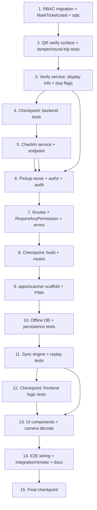

# Implementation Plan: Scanner PWA (Phase 15)

## Overview

This plan implements the Scanner PWA in dependency order, backend-first, so that
each layer is exercised by tests before the layer above it is built. The spine is:

1. RBAC migration + `MarkTicketUsed` query + sqlc regen (foundation).
2. `tickets/qr` verify surface + round-trip / tamper property tests.
3. `scanner` backend module — Verify service (display info + duplicate flags).
4. `scanner` backend module — CheckIn service + endpoint (idempotent `VALID→USED`).
5. Pickup reuse, audit actions, and permitted-event authorization.
6. Route registration in `server.go` + `RequireAnyPermission` helper + error taxonomy.
7. `apps/scanner` scaffold (Vite + Svelte 5 + vite-plugin-pwa) + app shell.
8. Client offline DB (IndexedDB via `idb`) + persistence property tests.
9. Client sync engine + replay/classification property tests.
10. Client UI components + camera decode integration.
11. End-to-end wiring, integration/smoke tests, README + CHANGELOG for Phase 15.

Testing conventions (from design Testing Strategy):
- Backend property tests in Go using `pgregory.net/rapid` (or `testing/quick`);
  DB-backed properties use a real test Postgres like the existing racepack
  integration tests (`services/api/tests/integration/`, build tag `integration`).
- Frontend property tests use `fast-check` + Vitest; IndexedDB via
  `fake-indexeddb`; the sync transport via an injectable mock transport.
- Every property test runs a **minimum of 100 iterations** and carries the tag
  comment `// Feature: scanner-pwa, Property {n}: {property text}`.
- Sub-tasks marked with `*` are optional test tasks and are not auto-implemented.

## Task Dependency Graph



```json
{
  "waves": [
    { "wave": 1, "tasks": ["1"], "dependsOn": [] },
    { "wave": 2, "tasks": ["2"], "dependsOn": ["1"] },
    { "wave": 3, "tasks": ["3"], "dependsOn": ["2"] },
    { "wave": 4, "tasks": ["4"], "dependsOn": ["3"] },
    { "wave": 5, "tasks": ["5"], "dependsOn": ["4"] },
    { "wave": 6, "tasks": ["6"], "dependsOn": ["3", "5"] },
    { "wave": 7, "tasks": ["7"], "dependsOn": ["6"] },
    { "wave": 8, "tasks": ["8"], "dependsOn": ["7"] },
    { "wave": 9, "tasks": ["9"], "dependsOn": ["8"] },
    { "wave": 10, "tasks": ["10"], "dependsOn": ["9"] },
    { "wave": 11, "tasks": ["11"], "dependsOn": ["10"] },
    { "wave": 12, "tasks": ["12"], "dependsOn": ["11"] },
    { "wave": 13, "tasks": ["13"], "dependsOn": ["11", "12"] },
    { "wave": 14, "tasks": ["14"], "dependsOn": ["13"] },
    { "wave": 15, "tasks": ["15"], "dependsOn": ["14"] }
  ]
}
```

## Tasks

- [x] 1. Backend foundation: RBAC migration, ticket transition query, sqlc regen
  - [x] 1.1 Create migration `00053_seed_checkin_rbac` (up + down)
    - Add `database/migrations/00053_seed_checkin_rbac.up.sql` and `.down.sql`
    - Insert `checkin.execute` permission and grant it to platform `manager` and
      `racepack-staff` roles, mirroring `00051_extend_racepack_rbac`
    - Down migration removes the grant and the permission (reversible)
    - _Requirements: 1.5, 5.1_

  - [x] 1.2 Add `MarkTicketUsed` sqlc query and confirm `LockTicketForUpdate` reuse
    - Add `-- name: MarkTicketUsed :one` to `database/queries/tickets.sql`:
      guarded `UPDATE tickets SET status='USED', used_at=COALESCE(narg used_at, now())
      WHERE id=$1 AND status='VALID' RETURNING *`
    - Verify existing `LockTicketForUpdate` query covers the row lock; reuse it
    - _Requirements: 5.1, 6.3_

  - [x] 1.3 Regenerate sqlc and verify the API package compiles
    - Run sqlc generation; confirm `MarkTicketUsed` appears in `internal/db`
    - Run `go build ./...` in `services/api`
    - _Requirements: 5.1_

- [x] 2. QR verify surface and round-trip / tamper property tests
  - [x] 2.1 Confirm and expose `qr.Signer.Verify` + structural decode helper
    - In `services/api/internal/modules/tickets/qr`, confirm `Verify(token)` returns
      `TicketRef{TicketID, EventID, Version}` and distinct errors for malformed
      tokens and unsupported versions
    - Add/confirm an exported structural-decode helper (segments, version,
      base64url payload) usable without the HMAC secret, for reuse by the client
      contract and offline validation reference
    - _Requirements: 2.2, 2.3, 2.4_

  - [x]* 2.2 Write property test: QR verification round-trip
    - Generate random `ticket_id`/`event_id` pairs, sign, then verify; assert the
      decoded `TicketRef` equals the originals
    - `// Feature: scanner-pwa, Property 1: QR verification round-trip`
    - **Property 1** — _Requirements: 2.2_

  - [x]* 2.3 Write property test: tampered / malformed / unsupported tokens rejected
    - For any validly signed token, mutate payload or signature, feed malformed
      strings and unsupported versions; assert `Verify` returns an error in all
      cases (no panic, no valid `TicketRef`)
    - `// Feature: scanner-pwa, Property 2: Tampered, malformed, or unsupported tokens are rejected without side effects`
    - **Property 2** — _Requirements: 2.3, 2.4, 2.6_

- [x] 3. Scanner module: Verify service (display info + duplicate flags)
  - [x] 3.1 Scaffold the `scanner` backend module
    - Create `services/api/internal/modules/scanner/` with `service.go`, `handler.go`,
      `dto.go`, `routes.go`, `errors.go`, `model.go`, `repository.go`, `tests/`
    - Define `Service` composition root and the `QRVerifier`, `TicketReader`,
      `PickupExecutor`, `Repository`, `AuditRecorder` interfaces per design
    - Define sentinel errors in `errors.go` (`ErrSignatureInvalid`, `ErrMalformedToken`,
      `ErrUnsupportedVersion`, `ErrEventMismatch`, `ErrTicketNotFound`,
      `ErrTicketCancelled`, `ErrAlreadyCheckedIn`, `ErrUnauthorizedEvent`,
      `ErrIdempotencyConflict`)
    - _Requirements: 2.2, 2.5, 3.1_

  - [x] 3.2 Implement `TicketReader.GetDisplayInfo` (whitelisted fields only)
    - Add a read query returning participant name, BIB number, category name, and
      ticket status; expose via the injected read interface (no cross-module DB
      access)
    - `DisplayInfo` DTO contains ONLY name, BIB, category, ticket status
    - _Requirements: 3.1, 3.4_

  - [x] 3.3 Implement `Service.Verify`
    - `qr.Verify(token)` → reject with typed error (audit `SCANNER_QR_REJECTED`
      on online rejection); assert `ref.EventID == in.EventID` else `ErrEventMismatch`
    - Load `DisplayInfo`; compute `alreadyPickedUp` via
      `racepack.GetPickupStatusByTicket` (+ `pickedUpAt`) and `alreadyCheckedIn`
      via ticket status `== USED` (+ `checkedInAt`)
    - Return `VerifyResult` DTO
    - _Requirements: 2.2, 2.5, 2.6, 3.1, 3.2, 3.3, 6.1, 6.4_

  - [x]* 3.4 Write property test: event-mismatch rejection
    - Generate tokens whose embedded `event_id` differs from the selected event;
      assert `Verify` returns `ErrEventMismatch` and no side effect
    - `// Feature: scanner-pwa, Property 3: Event-mismatch rejection`
    - **Property 3** — _Requirements: 2.5_

  - [x]* 3.5 Write property test: display information completeness
    - For any validated ticket, assert `VerifyResult` includes name, BIB, category,
      and ticket status sourced from that ticket
    - `// Feature: scanner-pwa, Property 5: Display information completeness`
    - **Property 5** — _Requirements: 3.1_

  - [x]* 3.6 Write property test: no sensitive data in display
    - Serialize `VerifyResult` for random tickets; assert the JSON contains only
      whitelisted keys and never card data, passwords, or full contact details
    - `// Feature: scanner-pwa, Property 6: No sensitive data in display`
    - **Property 6** — _Requirements: 3.4_

  - [x]* 3.7 Write property test: duplicate flags and original timestamps
    - For random ticket states, assert `alreadyPickedUp` is true exactly when an
      active `PICKED_UP` record exists (with its timestamp) and `alreadyCheckedIn`
      is true exactly when status is `USED` (with its timestamp). DB-backed test
      against real test Postgres
    - `// Feature: scanner-pwa, Property 7: Duplicate flags and original timestamps`
    - **Property 7** — _Requirements: 3.2, 3.3, 6.1, 6.4_

- [x] 4. Checkpoint — Ensure all backend tests pass
  - Run `go test ./...` (and DB-backed property tests). Ask the user if questions arise.

- [x] 5. Scanner module: CheckIn service + endpoint (idempotent VALID→USED)
  - [x] 5.1 Implement `Service.CheckIn` transaction
    - In one tx: `SELECT ... FOR UPDATE` the ticket row (`LockTicketForUpdate`);
      `CANCELLED` → `ErrTicketCancelled`; `event_id` mismatch → `ErrEventMismatch`;
      `USED` → return duplicate result with existing `used_at` (no transition);
      `VALID` → `MarkTicketUsed` with `used_at = COALESCE(scannedAt, now())`
    - Return `CheckInResult` DTO (`status=USED`, `checkedInAt`, `duplicate`)
    - _Requirements: 5.1, 5.2, 6.2, 6.3_

  - [x] 5.2 Wrap CheckIn handler with platform idempotency
    - `POST /scan/check-in` handler parses `CheckInRequest`, uses
      `LookupIdempotency`/`HashRequest`/`StoreIdempotency` with scope
      `"scanner.checkin"`; same key + same payload returns cached body, same key +
      different payload returns `ErrIdempotencyConflict`
    - _Requirements: 5.1, 8.3_

  - [x]* 5.3 Write property test: check-in transition and idempotence
    - Generate tickets in `VALID`/`USED`/`CANCELLED`; assert `VALID→USED` once with
      timestamp, `CANCELLED` rejected with no transition, `USED` returns duplicate
      with no further transition. DB-backed against real test Postgres
    - `// Feature: scanner-pwa, Property 10: Check-in transition and idempotence`
    - **Property 10** — _Requirements: 5.1, 5.2, 6.2, 6.3_

  - [x]* 5.4 Write property test: server idempotency is exactly-once
    - Replay the same operation N times with one Idempotency-Key; assert the effect
      is applied once and the identical original response body is returned for
      every replay. DB-backed against real test Postgres
    - `// Feature: scanner-pwa, Property 11: Server idempotency is exactly-once`
    - **Property 11** — _Requirements: 8.3_

- [x] 6. Pickup reuse, permitted-event authorization, and audit actions
  - [x] 6.1 Wire pickup reuse through the scanner
    - Inject `racepack.Service` as `PickupExecutor`; the scanner replays offline
      pickups to the existing `POST /racepack/pickups` (no new pickup logic).
      Confirm `GetPickupStatusByTicket` is exposed for verify duplicate flags
    - _Requirements: 4.1, 6.3, 8.1_

  - [x]* 6.2 Write property test: pickup eligibility enforcement
    - For tickets that are `CANCELLED`, have no BIB, or whose order is not `PAID`,
      assert pickup is rejected with the corresponding error and no record is
      created. DB-backed against real test Postgres
    - `// Feature: scanner-pwa, Property 8: Pickup eligibility enforcement`
    - **Property 8** — _Requirements: 4.2, 4.3, 4.4_

  - [x]* 6.3 Write property test: pickup creates exactly one record
    - For an eligible ticket, issue many concurrent/retried pickup confirmations;
      assert exactly one `PICKED_UP` record (relies on the unique partial index).
      DB-backed, includes a parallel-goroutine race like the racepack tests
    - `// Feature: scanner-pwa, Property 9: Pickup creates exactly one record`
    - **Property 9** — _Requirements: 4.1, 6.3_

  - [x] 6.4 Implement permitted-event resolution and per-operation authorization
    - Add `/scan/events` (or reuse event listing) filtered to events where the
      staff holds `racepack.execute` or `checkin.execute`; reuse
      `AssertEventInOrg`; reject operations targeting non-permitted events with
      `ErrUnauthorizedEvent`
    - _Requirements: 1.2, 1.4, 1.5_

  - [x]* 6.5 Write property test: operations authorized only for permitted events
    - Generate event/permission assignments; assert the returned event set equals
      exactly those with `racepack.execute` or `checkin.execute`, and any operation
      on a non-permitted event is rejected with an authorization error
    - `// Feature: scanner-pwa, Property 4: Operations are authorized only for permitted events`
    - **Property 4** — _Requirements: 1.2, 1.4, 1.5_

  - [x] 6.6 Implement audit writes for check-in and QR rejection
    - Write `SCANNER_CHECKIN_COMPLETED` on check-in (ticket id, staff id, timestamp);
      write `SCANNER_QR_REJECTED` on online signature rejection; for offline-synced
      ops set audit `at` and `used_at` to the original `scannedAt`. Audit is
      best-effort and never rolls back the action
    - _Requirements: 10.1, 10.2, 10.3, 10.4_

  - [x]* 6.7 Write property test: audit content completeness
    - For any recorded pickup or check-in, assert an audit entry exists containing
      the ticket id, staff id, and a timestamp. DB-backed
    - `// Feature: scanner-pwa, Property 18: Audit content completeness`
    - **Property 18** — _Requirements: 10.1, 10.2_

  - [x]* 6.8 Write property test: offline-synced audit uses original scan timestamp
    - For synced ops carrying `scannedAt`, assert the audit entry timestamp equals
      the original scan time, not the sync time. DB-backed
    - `// Feature: scanner-pwa, Property 19: Offline-synced audit uses the original scan timestamp`
    - **Property 19** — _Requirements: 10.3_

  - [x]* 6.9 Write unit test: invalid-signature online scan writes rejection audit
    - Example test asserting a `SCANNER_QR_REJECTED` audit entry is written on an
      online invalid-signature scan
    - _Requirements: 10.4_

- [x] 7. Route registration, RequireAnyPermission helper, and error taxonomy mapping
  - [x] 7.1 Add `RequireAnyPermission` middleware helper
    - In `services/api/internal/platform/middleware/authz.go`, add
      `RequireAnyPermission(loader, perms...)` alongside `RequirePermission`
    - _Requirements: 1.4, 2.2_

  - [x] 7.2 Implement `Handler.RegisterEventRoutes` and mount in `server.go`
    - Mount `/scan/verify` behind `RequireAnyPermission("racepack.execute","checkin.execute")`
      and `/scan/check-in` behind `RequirePermission("checkin.execute")` under the
      org/event group; construct `scannerSvc`/`scannerHandler` in `server.go`
      following the racepack wiring
    - _Requirements: 1.4, 2.2, 5.1_

  - [x] 7.3 Implement handler `writeError` taxonomy mapping
    - Map sentinel errors to HTTP codes and stable codes per the design table
      (`QR_SIGNATURE_INVALID` 422, `QR_MALFORMED` 400, `EVENT_MISMATCH` 404,
      `TICKET_CANCELLED` 409, `ALREADY_CHECKED_IN` 409, `FORBIDDEN_EVENT` 403,
      `IDEMPOTENCY_CONFLICT` 409, …); never leak raw internal errors
    - _Requirements: 2.3, 2.4, 2.5, 4.2, 5.2, 8.6_

- [x] 8. Checkpoint — Ensure backend build, tests, and routes are green
  - Run `go build ./...` and `go test ./...`. Ask the user if questions arise.

- [x] 9. Frontend scaffold: apps/scanner (Vite + Svelte 5 + PWA) + app shell
  - [x] 9.1 Scaffold `apps/scanner`
    - Create `apps/scanner` with Vite + Svelte 5 (TypeScript). No React/Next/Vue/SvelteKit
    - Add Vitest + `fast-check` + `fake-indexeddb` + `idb` + `qr-scanner` deps
    - Create app shell entry, base layout, and typed `lib/api.ts` fetch wrapper
      (Bearer token + `Idempotency-Key` header support)
    - _Requirements: 9.1, 9.2_

  - [x] 9.2 Configure `vite-plugin-pwa` (manifest + service worker)
    - Add manifest (name, icons, `display: standalone`, `start_url`) and a Workbox
      service worker that precaches the app shell and static assets
    - _Requirements: 9.1, 9.2_

- [x] 10. Client offline DB (IndexedDB via idb) + persistence property tests
  - [x] 10.1 Implement `lib/offline-db.ts`
    - Define `ScanOperation` and `CachedTicketState` types; create two object
      stores `operations` (keyPath `idempotencyKey`) and `ticketState`
      (keyPath `ticketId`); implement enqueue/list/remove/update and cached-state
      read/write; on startup restore all non-`FAILED` ops into the in-memory queue
    - _Requirements: 7.2, 7.3, 7.6_

  - [x] 10.2 Implement offline structural validation + enqueue path
    - Structural validation: segment structure, supported version, base64url
      payload, parseable `ticket_id`/`event_id`, `event_id` matches selected event.
      Accepted tokens enqueue with a fresh UUID v4 Idempotency-Key; rejected tokens
      do not enqueue
    - _Requirements: 7.1, 7.2_

  - [x] 10.3 Implement offline duplicate detection + pending count
    - Check cached ticket state before enqueue; surface a Duplicate_Warning and do
      not enqueue a second op for the same action; expose pending count = number of
      `PENDING` ops
    - _Requirements: 7.4, 7.5_

  - [x]* 10.4 Write property test: offline structural validation
    - Generate token strings; assert acceptance iff the structural criteria hold and
      `event_id` matches; accepted enqueue, rejected do not
    - `// Feature: scanner-pwa, Property 12: Offline structural validation`
    - **Property 12** — _Requirements: 7.1_

  - [x]* 10.5 Write property test: unique idempotency key per queued operation
    - Enqueue random sequences; assert all assigned Idempotency-Keys are pairwise
      distinct
    - `// Feature: scanner-pwa, Property 13: Unique idempotency key per queued operation`
    - **Property 13** — _Requirements: 7.2_

  - [x]* 10.6 Write property test: offline queue persistence round-trip
    - With `fake-indexeddb`, persist a random set of ops, simulate restart, restore;
      assert the restored queue equals the original unsynchronised set
    - `// Feature: scanner-pwa, Property 14: Offline queue persistence round-trip`
    - **Property 14** — _Requirements: 7.3, 7.6_

  - [x]* 10.7 Write property test: offline duplicate detection against cached state
    - For tickets already recorded in cached state, assert re-scanning offline
      surfaces a Duplicate_Warning and does not enqueue a second op
    - `// Feature: scanner-pwa, Property 15: Offline duplicate detection against cached state`
    - **Property 15** — _Requirements: 7.4_

  - [x]* 10.8 Write property test: pending count reflects the queue
    - For any queue state, assert displayed pending count equals the number of
      `PENDING` ops
    - `// Feature: scanner-pwa, Property 16: Pending count reflects the queue`
    - **Property 16** — _Requirements: 7.5_

- [x] 11. Client sync engine + replay/classification property tests
  - [x] 11.1 Implement `lib/sync.ts` Sync_Engine
    - Drain the queue on connectivity restore, transmitting each op with its
      Idempotency-Key; classify responses: `2xx`/cached and `409 ALREADY_*` → drain
      (remove from queue + Local_Store); network/`5xx`/timeout → keep `PENDING`;
      other `4xx` → `FAILED` and surface for manual resolution. Expose a `SyncState`
      store (`online`, `pending`, `failed`) with an injectable transport
    - _Requirements: 8.1, 8.2, 8.4, 8.5, 8.6_

  - [x]* 11.2 Write property test: sync engine transmits, retains, and fails correctly
    - With a mock transport: succeeding → every op transmitted once (with key) then
      removed; network-error → every op stays `PENDING`; non-retryable rejection →
      every op moves to `FAILED` and is surfaced
    - `// Feature: scanner-pwa, Property 17: Sync engine transmits, retains, and fails correctly`
    - **Property 17** — _Requirements: 8.1, 8.2, 8.4, 8.5, 8.6_

- [x] 12. Checkpoint — Ensure all frontend logic tests pass
  - Run `vitest --run`. Ask the user if questions arise.

- [x] 13. Client UI components + camera decode integration
  - [x] 13.1 Implement auth + navigation components
    - `Login.svelte` (store/clear session token in Local_Store), `EventPicker.svelte`
      (list Permitted_Events, select event), `ModeToggle.svelte` (Pickup vs Check-In)
    - _Requirements: 1.1, 1.2, 1.4, 1.6, 5.4_

  - [x] 13.2 Implement `ScannerCamera.svelte` with mandatory `$effect` cleanup
    - Own the `MediaStream` + `qr-scanner` decode loop inside `$effect`; return a
      cleanup that calls `scanner.stop()` and `scanner.destroy()` on unmount / mode
      change; emit decoded token strings
    - _Requirements: 2.1_

  - [x] 13.3 Implement participant + confirm + status components
    - `ParticipantCard.svelte` (name, BIB, category, status, duplicate flags +
      original timestamps), `ConfirmAction.svelte` (confirm pickup or check-in with
      success feedback), `OfflineSyncStatus.svelte` (online/offline badge + pending
      count via the sync store)
    - _Requirements: 3.1, 3.2, 3.3, 4.5, 5.3, 6.1, 6.2, 6.4, 7.5_

  - [x]* 13.4 Write unit/example tests for UI behavior
    - Login success stores token; invalid credentials rejected; logout clears token;
      mode toggle presents the correct confirmation action
    - _Requirements: 1.1, 1.3, 1.6, 5.4_

- [x] 14. End-to-end wiring, integration/smoke tests, and docs
  - [x] 14.1 Wire the full client flow together
    - Connect Login → EventPicker → ModeToggle → ScannerCamera → verify (online) or
      structural-validate + enqueue (offline) → ParticipantCard → ConfirmAction →
      sync; no orphaned modules
    - _Requirements: 2.1, 2.2, 4.1, 5.1, 7.1, 8.1_

  - [x]* 14.2 Write smoke test: manifest + service worker installability
    - Assert the production build emits a valid web app manifest and a service
      worker (Workbox precache present)
    - _Requirements: 9.1_

  - [x]* 14.3 Write integration test: offline app shell loads from cache
    - Assert the installed app renders its shell from cache with no network
    - _Requirements: 9.2_

  - [x]* 14.4 Write backend integration tests for scan endpoints
    - Under `services/api/tests/integration/` (build tag `integration`, real
      Postgres): online scan→verify→check-in, offline replay with Idempotency-Key,
      and forged-token sync rejection → FAILED path
    - _Requirements: 2.2, 5.1, 8.3, 8.6_

  - [x] 14.5 Update CHANGELOG.md and README.md for Phase 15
    - Add a `## [Phase 15]` CHANGELOG entry (migration 00053, `MarkTicketUsed`,
      scanner module + endpoints, `RequireAnyPermission`, `apps/scanner` PWA, offline
      queue + sync, tests) and a Phase 15 README section, consistent with prior phases
    - _Requirements: 9.1, 10.1_

- [ ] 15. Final checkpoint — Ensure all tests pass
  - Run backend `go test ./...` (+ integration), frontend `vitest --run`, and confirm
    the build succeeds. Ask the user if questions arise.

## Notes

- Tasks marked with `*` are optional test sub-tasks and can be skipped for a faster MVP.
- Each task references specific requirements; property test tasks additionally
  reference their design Correctness Property and carry the required tagging comment
  at a minimum of 100 iterations.
- Backend property tests use `pgregory.net/rapid`/`testing/quick`; DB-backed
  properties (7, 8, 9, 10, 11, 18, 19) run against a real test Postgres. Frontend
  property tests (12–17) use `fast-check` + Vitest + `fake-indexeddb`; Property 4
  (authorization) is validated backend-side against the RBAC loader.
- Checkpoints (tasks 4, 8, 12, 15) enforce incremental validation between layers.
