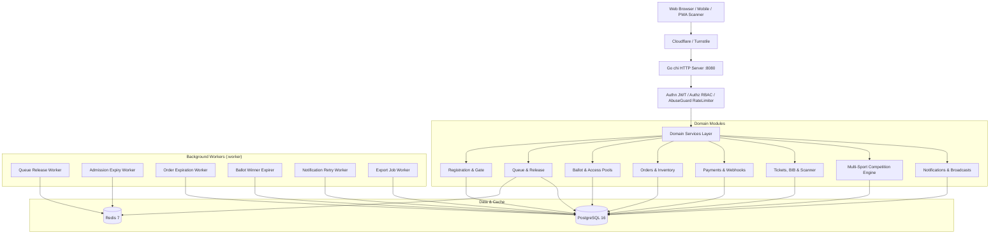

# IvyTicketing Documentation System

Welcome to the verified documentation system for **IvyTicketing**, an enterprise multi-tenant ticketing, registration, and competition platform designed for endurance races and multi-sport tournaments.

This documentation is verified against the actual repository implementation across Go backend services, PostgreSQL database schema, Redis caching and queue systems, Astro web portal, and Svelte PWA scanner.

---

## Documentation Directory Structure

The documentation is organized into clear domains tailored to different stakeholders:

```
docs/
├── README.md                          # Master documentation index (this file)
├── getting-started/                   # Initial onboarding guides
│   ├── user.md                        # Participant onboarding
│   ├── organizer.md                   # Organizer setup and event launch
│   └── admin.md                       # Platform administrator onboarding
├── concepts/                          # Core system concepts and domain models
│   ├── platform-overview.md           # Architecture, tenancy, and actors
│   ├── registration.md                # 8 registration modes and admission policies
│   ├── queue.md                       # Redis war queue, polling, and protection
│   ├── ballot.md                      # Lottery draws, grants, and winner expiration
│   ├── orders-and-payments.md         # Order lifecycle, holds, and gateways
│   ├── tickets.md                     # Signed QR tickets and issuance
│   ├── bib.md                         # BIB assignment and management
│   ├── racepack.md                    # Pickup counters, slots, and problem desk
│   └── competition-engine.md          # Multi-sport scoring, matches, and stages
├── user-guides/                       # Step-by-step user journeys
│   ├── participant.md                 # Participant user journey
│   ├── organizer.md                   # Organizer event and operations guide
│   └── admin.md                       # Platform administrator operations
├── architecture/                      # Technical system architecture
│   ├── overview.md                    # End-to-end architecture and system boundaries
│   ├── backend.md                     # Go backend modules and transaction patterns
│   ├── frontend.md                    # Astro web portal and Svelte scanner PWA
│   ├── database.md                    # PostgreSQL schema and 68 migrations
│   ├── redis.md                       # Redis data structures and caching
│   └── workers.md                     # Asynchronous background jobs and cron workers
├── workflows/                         # Detailed sequence diagrams and traces
│   ├── direct-registration.md         # Direct registration flow
│   ├── queue-registration.md          # High-traffic queue flow
│   ├── ballot-registration.md         # Lottery application and winner conversion
│   ├── checkout.md                    # Checkout and inventory reservation
│   ├── payment-webhook.md             # Payment webhook and ticket generation
│   ├── bib.md                         # BIB assignment workflows
│   └── results.md                     # Result processing and certificate flow
├── reference/                         # Authoritative references
│   ├── permissions.md                 # Verified permission matrix and BOLA rules
│   ├── state-machines.md              # Lifecycle state machines and transitions
│   ├── api.md                         # Complete HTTP REST API reference
│   ├── errors.md                      # Error code catalog and handling
│   └── configuration.md               # Environment variables and deployment flags
├── operations/                        # Production operations and runbooks
│   ├── runbook.md                     # Service management and war-day procedures
│   ├── troubleshooting.md             # Common incident diagnostics with SQL queries
│   ├── backups.md                     # Database backup and recovery procedures
│   └── migrations.md                  # Migration guidelines and schema rollbacks
├── development/                       # Developer guide
│   ├── setup.md                       # Local development environment setup
│   ├── testing.md                     # Test execution and load testing
│   ├── contributing.md                # Contribution standards and code hygiene
│   └── debugging.md                   # Diagnostics, profiling, and trace inspection
└── security/                          # Security architecture
    └── security-model.md              # Authentication, RBAC, BOLA, and abuse controls
```

---

## Quick Navigation by Role

### For Participants
- [Participant Onboarding Guide](file:///root/ivyticketing/docs/getting-started/user.md)
- [Participant Step-by-Step User Journey](file:///root/ivyticketing/docs/user-guides/participant.md)
- [How Registration Modes Work](file:///root/ivyticketing/docs/concepts/registration.md)
- [Digital Tickets and QR Codes](file:///root/ivyticketing/docs/concepts/tickets.md)
- [Race Results and Finisher Certificates](file:///root/ivyticketing/docs/workflows/results.md)

### For Event Organizers
- [Organizer Onboarding and Event Launch](file:///root/ivyticketing/docs/getting-started/organizer.md)
- [Organizer Operations and Event Management](file:///root/ivyticketing/docs/user-guides/organizer.md)
- [Managing Queue and Traffic Surges](file:///root/ivyticketing/docs/concepts/queue.md)
- [Running Ballots and Lotteries](file:///root/ivyticketing/docs/concepts/ballot.md)
- [BIB Number Allocation and Racepack Management](file:///root/ivyticketing/docs/concepts/bib.md)
- [Multi-Sport Competition Engine](file:///root/ivyticketing/docs/concepts/competition-engine.md)
- [Organizer Permissions Reference](file:///root/ivyticketing/docs/reference/permissions.md)

### For Platform Administrators
- [Platform Admin Guide](file:///root/ivyticketing/docs/getting-started/admin.md)
- [Administrator Operations Guide](file:///root/ivyticketing/docs/user-guides/admin.md)
- [System Architecture Overview](file:///root/ivyticketing/docs/architecture/overview.md)
- [Operator Runbook and War-Day Guide](file:///root/ivyticketing/docs/operations/runbook.md)
- [Platform Permissions Matrix](file:///root/ivyticketing/docs/reference/permissions.md)

### For Developers and Integrators
- [Local Development Setup](file:///root/ivyticketing/docs/development/setup.md)
- [Testing and Concurrency Verification](file:///root/ivyticketing/docs/development/testing.md)
- [REST API Reference](file:///root/ivyticketing/docs/reference/api.md)
- [State Machines Reference](file:///root/ivyticketing/docs/reference/state-machines.md)
- [Environment Configuration Catalog](file:///root/ivyticketing/docs/reference/configuration.md)
- [Security Model and BOLA Protections](file:///root/ivyticketing/docs/security/security-model.md)

---

## Core System Architecture Snapshot



---

## Document Verification Guarantee

Every workflow and architecture pattern documented in this system has been verified against the underlying source code:
- Go backend: [`services/api/internal/`](file:///root/ivyticketing/services/api/internal/)
- SQL queries and migrations: [`database/queries/`](file:///root/ivyticketing/database/queries/) and [`database/migrations/`](file:///root/ivyticketing/database/migrations/)
- Frontend applications: [`apps/web/`](file:///root/ivyticketing/apps/web/) and [`apps/scanner/`](file:///root/ivyticketing/apps/scanner/)
- Integration tests: [`services/api/internal/modules/registration/tests/admission_allocation_audit_test.go`](file:///root/ivyticketing/services/api/internal/modules/registration/tests/admission_allocation_audit_test.go)
