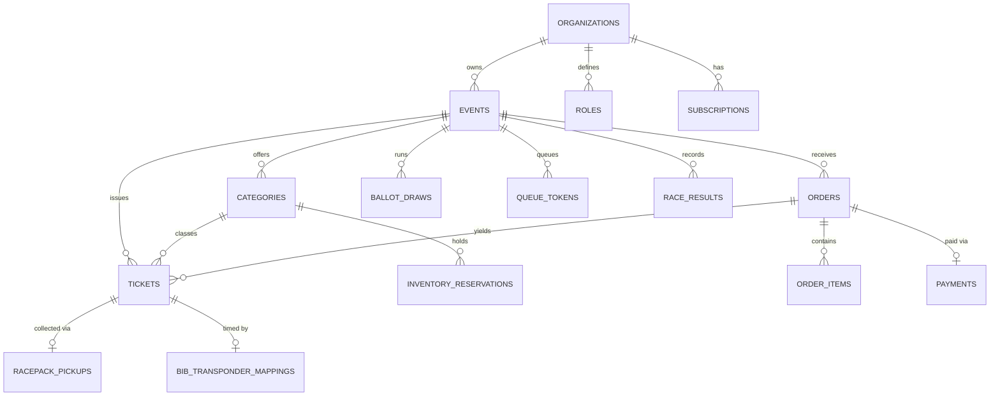

# Database Schema and Persistence Architecture

IvyTicketing relies on PostgreSQL 16 as its single authoritative source of truth. The database schema is version-controlled via 68 sequential Goose SQL migrations located in [`database/migrations/`](file:///root/ivyticketing/database/migrations/).

---

## 1. Core Entity Relational Diagram

---

## 2. Table Catalog by Domain

### Identity, RBAC, and Audit
- `users`: Core account credentials, email, password hash, and `is_platform_admin` boolean flag.
- `roles` & `permissions`: Multi-tenant RBAC catalog. Contains 6 system roles and 38 granular permissions.
- `member_roles`: Maps organization staff members to assigned roles.
- `audit_logs`: Immutable, append-only security log recording actor ID, IP address, action slug, and payload diffs.

### Tenancy and Billing
- `organizations`: Tenant profiles, slugs, and primary billing metadata.
- `org_branding` & `custom_domains`: Whitelabel customization and DNS TXT verification records.
- `subscription_packages`: Platform tiers (`Starter`, `Professional`, `Enterprise`) with fee basis points (`fee_bps`).
- `platform_fee_ledger`: Per-order fee deductions recorded atomically at payment time.
- `platform_invoices`: Aggregated monthly statements issued to organizers.

### Events, Categories, and Forms
- `events`: Event dates, locations, descriptions, and active `registration_mode`.
- `categories`: Ticket types, distances, base prices, total quotas, and age constraints.
- `category_bib_sequences`: Database sequence counters guaranteeing gap-free sequential BIB numbering.
- `registration_forms` & `form_fields`: Custom participant survey schemas and waiver checkboxes.

### Admission, Queue, and Ballot
- `queue_tokens`: In-line status (`WAITING`, `ALLOWED`, `EXPIRED`, `COMPLETED`, `BLOCKED`) for war queue participants.
- `queue_admissions`: Single-use admission tokens granting temporary checkout access.
- `ballot_draws`: Lottery configurations, application windows, and winning capacity counts.
- `ballot_entries`: Participant lottery applications and conversion statuses (`APPLIED`, `WINNER`, `WAITLISTED`, `CONVERTED`, `LAPSED`).
- `access_pools` & `access_grants`: Quota reservations and single-use cryptographic grants for VIPs and corporate partners.

### Orders and Payments
- `orders`: Order drafts and transaction states (`DRAFT`, `PENDING_PAYMENT`, `PAID`, `EXPIRED`, `CANCELLED`, `REFUNDED`).
- `inventory_reservations`: Atomic 15-minute holds locking category quota during payment processing.
- `payments`: Outbound gateway payment invoice requests.
- `payment_webhooks`: Inbound gateway callback log with cryptographic signatures and idempotency hashes.

### Ticketing and Race Operations
- `tickets`: Digital ticket records with cryptographic HMAC signatures and check-in statuses (`VALID`, `USED`, `CANCELLED`).
- `bib_transponder_mappings`: Links physical race bib numbers to electronic RFID timing chips.
- `racepack_pickup_slots`: Capacity-constrained time windows for expo collection.
- `racepack_pickup_records`: Verification logs recording physical hand-off to participants or authorized proxies.
- `racepack_problem_cases`: Dispute resolution desk case management.

### Competition and Timing
- `race_results`: Official gross gun times, net chip times, and rankings.
- `race_split_times`: Intermediate split mat checkpoint passings.
- `competition_stages` & `competition_matches`: Normalized tournament fixtures, brackets, heats, and rosters.

---

## 3. Indexing and Integrity Constraints

- **Composite Event Scoping**: Indexes on `(event_id, status)` and `(organization_id, id)` ensure sub-millisecond query execution and eliminate table scans.
- **Unique BIB Enforcement**: Enforced by `UNIQUE (event_id, bib_number)` on the `tickets` table.
- **Atomic Capacity Checks**: Enforced via check constraints such as `CHECK (reserved_count <= capacity)` on pickup slots and `CHECK (available_quota >= 0)` on inventory pools.
