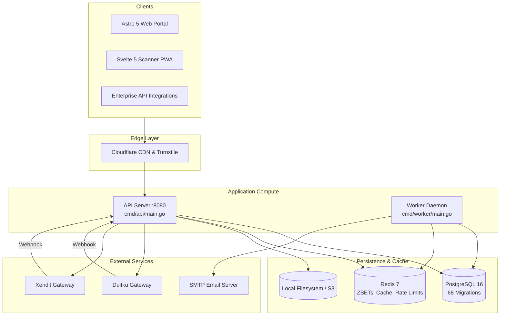

# Technical Architecture Overview

IvyTicketing is designed as a modular monolith in Go, backed by PostgreSQL 16 for authoritative state and Redis 7 for high-concurrency caching and queues.

---

## 1. System Topology and Component Boundaries

---

## 2. Component Breakdown

### 1. API Server (`cmd/api/main.go`)
- **HTTP Engine**: Built using `go-chi/chi/v5` for lightweight, zero-allocation routing.
- **Middleware Pipeline**:
  - Request ID injection (`middleware.RequestID`)
  - Prometheus metrics instrumentation (`metrics.Middleware`)
  - CORS header management
  - IP reputation and anti-bot enforcement (`abuse.Guard`)
  - JWT authentication (`middleware.Authn`)
  - Multi-tenant RBAC and BOLA verification (`middleware.RequirePermission`)
- **Service Assembly**: All domain modules are wired together using dependency injection in [server.go](file:///root/ivyticketing/services/api/internal/app/server.go).

### 2. Background Worker Daemon (`cmd/worker/main.go`)
- **Queue Release Loop**: Runs every 10 seconds to pop admitted participants from Redis sorted sets.
- **Admission Expiration Loop**: Purges expired queue tokens after the 5-minute checkout window elapses.
- **Order Expiration Loop**: Runs every 60 seconds to release inventory holds for unpaid `PENDING_PAYMENT` orders older than 15 minutes.
- **Ballot Winner Expirer**: Identifies unpaid lottery winners past their payment deadline, lapses their entries, and automatically promotes waitlisted entrants.
- **Notification Retry Loop**: Exponential backoff retry worker for failed email/SMS deliveries.
- **Async Report Exporter**: Processes queued CSV export jobs and writes files to storage.

### 3. Web Portal (`apps/web`)
- Built with **Astro 5** and **Tailwind CSS**.
- Provides server-rendered marketing and discovery pages alongside reactive client islands for event registration, live queue progress bars, and participant dashboards.

### 4. Scanner PWA (`apps/scanner`)
- Built with **Svelte 5** and **Vite**.
- Progressive Web App with offline service worker support, camera QR scanning, and local cryptographic verification of digital ticket HMAC tokens.

---

## 3. Communication Patterns and Invariants

1. **PostgreSQL is Authoritative**:
   Redis is treated as an ephemeral performance accelerator. If Redis is restarted or flushed, no orders, payments, tickets, or inventory quotas are lost. The queue can be reconstructed from PostgreSQL `queue_tokens` if necessary.
2. **Duck-Typed Decoupling**:
   To prevent circular dependencies across Go packages, modules interact via duck-typed interfaces (e.g. `orders.WithNotifier`, `orders.WithGrantConsumer`, `payments.WithFeeRecorder`).
3. **Transaction Boundaries**:
   Operations affecting inventory, orders, access grants, and ballot status execute within single, atomic PostgreSQL transactions.
