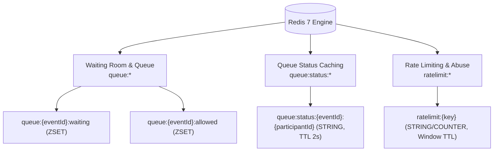

# Redis Architecture, Keyspaces, and Caching

IvyTicketing utilizes Redis 7 as an ephemeral caching, rate limiting, and waiting-room queue engine.

PostgreSQL is the durable source of truth; all Redis data structures are designed to be rebuildable without permanent data loss.

---

## 1. Key Primitives and Keyspace Patterns

The Redis keyspace is strictly structured across three operational domains:



### Redis Key Directory

| Key Pattern | Redis Type | TTL | Purpose |
| :--- | :--- | :--- | :--- |
| `queue:{eventId}:waiting` | `ZSET` | Persistent | Ordered waiting pool. Score represents the millisecond arrival timestamp or tie-breaker score. |
| `queue:{eventId}:allowed` | `ZSET` | Persistent | Admitted participants pool. Score represents the expiration timestamp (`UnixEpoch + 300s`). |
| `queue:status:{eventId}:{participantId}` | `STRING` | 2 seconds | Cached JSON status for a participant in line. Prevents database connection exhaustion during mass polling. |
| `ratelimit:{key}` | `STRING` | Window duration | Fixed-window token counter for API rate limiting and bot mitigation. |

---

## 2. Queue Operations and Atomic Pipelines

Queue state mutations are executed using Redis transactions (`TxPipeline`) to eliminate race conditions:

### 1. Adding a Waiting Participant ([`AddWaiting`](file:///root/ivyticketing/services/api/internal/platform/queue/queue.go#L22))
```
ZADD queue:{eventId}:waiting {score} {participantId}
```

### 2. Promoting to Allowed ([`MoveToAllowed`](file:///root/ivyticketing/services/api/internal/platform/queue/queue.go#L42))
Executed by the queue release worker inside an atomic pipeline:
```
MULTI
ZREM queue:{eventId}:waiting {participantId}
ZADD queue:{eventId}:allowed {expiresAtUnix} {participantId}
EXEC
```

### 3. Evicting from Allowed ([`RemoveAllowed`](file:///root/ivyticketing/services/api/internal/platform/queue/queue.go#L58))
Triggered when the participant completes checkout:
```
ZREM queue:{eventId}:allowed {participantId}
```

---

## 3. Rate Limiting and Fail-Open Philosophy

The [ratelimit package](file:///root/ivyticketing/services/api/internal/platform/ratelimit/ratelimit.go) implements an in-memory counter with an explicit **Fail-Open** guarantee:

```go
func (l *Limiter) Allow(ctx context.Context, key string, limit int, window time.Duration) (bool, error) {
    rk := "ratelimit:" + key
    n, err := l.c.Incr(ctx, rk).Result()
    if err != nil {
        return true, nil // FAIL-OPEN: Never block legitimate users if Redis fails
    }
    if n == 1 {
        _ = l.c.Expire(ctx, rk, window).Err()
    }
    return n <= int64(limit), nil
}
```

### Operational Resilience
If Redis restarts or network partitions occur between the API server and Redis:
- Public catalog browsing and checkout operations continue operating normally.
- Rate limiters fail open rather than dropping user traffic with `500 Internal Error`.
- Once Redis reconnects, queue and rate-limiting enforcement resume automatically.
