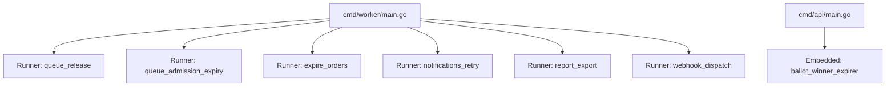
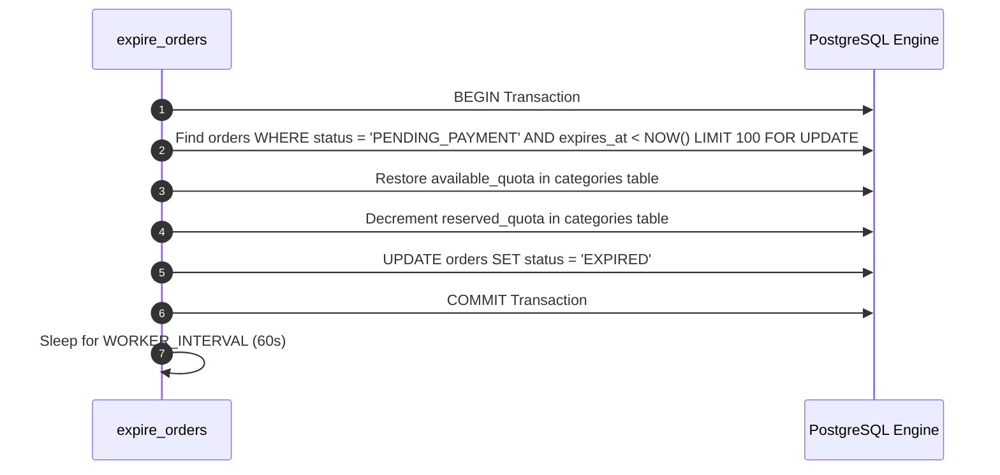

# Asynchronous Background Workers and Daemons

IvyTicketing executes long-running asynchronous tasks, sweep jobs, and queue release loops in a dedicated worker daemon compiled from [`cmd/worker/main.go`](file:///root/ivyticketing/services/api/cmd/worker/main.go).

---

## 1. Worker Daemon Architecture

All workers utilize a standardized runner interface defined in [`services/api/internal/platform/worker/`](file:///root/ivyticketing/services/api/internal/platform/worker/):

### Process Lifecycle and Signal Handling

- **Graceful Shutdown**: The worker daemon captures `SIGINT` and `SIGTERM` signals using `signal.NotifyContext`.
- **In-Flight Job Completion**: When a shutdown signal is received, runners complete their currently executing batch before releasing database connection pools.

---

## 2. Worker Catalog and Operational Schedules

| Worker Name | Host Process | Execution Interval | Default Batch | Purpose |
| :--- | :--- | :--- | :--- | :--- |
| `queue_release` | `cmd/worker` | `10s` (`QUEUE_RELEASE_INTERVAL`) | Configured Rate | Pops waiting participants from Redis sorted set into the allowed pool. |
| `queue_admission_expiry` | `cmd/worker` | `10s` (`QUEUE_RELEASE_INTERVAL`) | 500 tokens | Identifies and purges expired queue admission tokens past the 5-minute checkout window. |
| `expire_orders` | `cmd/worker` | `1m` (`WORKER_INTERVAL`) | 100 orders | Releases 15-minute inventory holds for unpaid `PENDING_PAYMENT` orders and marks them `EXPIRED`. |
| `ballot_winner_expirer` | `cmd/api` | `1m` | All expired | Identifies lottery winners past `payment_deadline`, marks them `LAPSED`, and promotes top waitlisted entrants. |
| `notifications_retry` | `cmd/worker` | `1m` (`WORKER_INTERVAL`) | 50 messages | Drains failed email and SMS delivery records and retries delivery with exponential backoff. |
| `report_export` | `cmd/worker` | `1m` (`WORKER_INTERVAL`) | 10 jobs | Drains `PENDING` export requests, generates CSV files, and uploads to S3 or local storage. |
| `webhook_dispatch` | `cmd/worker` | `1m` (`WORKER_INTERVAL`) | 50 deliveries | Dispatches outbound enterprise webhooks with HMAC-SHA256 signatures; marks persistent failures as `DEAD`. |

---

## 3. Deep Dive: Order Expiration Worker (`expire_orders`)

The order expiration loop ensures that abandoned carts do not permanently tie up category capacity.

### Concurrency Protection
The query uses `FOR UPDATE SKIP LOCKED` where applicable to ensure that multiple running worker instances do not contend or double-release inventory reservations.
