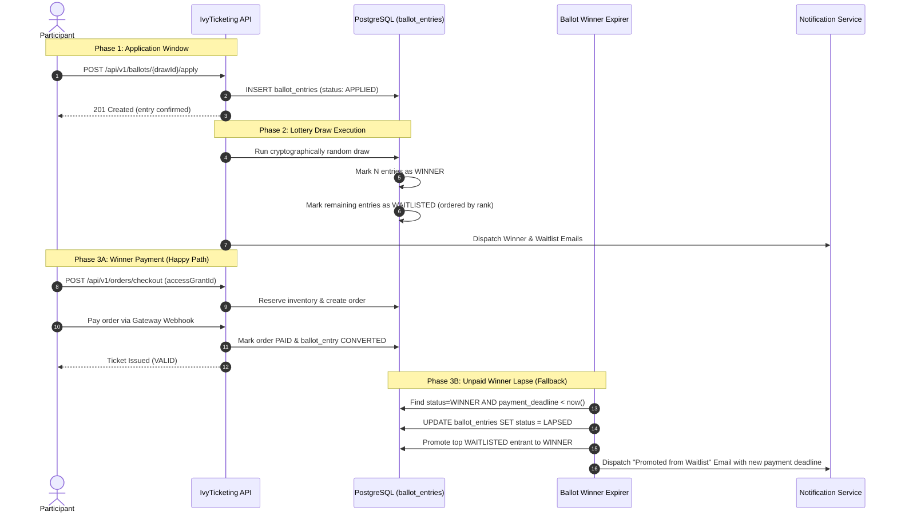

# Ballot and Lottery Engine

The IvyTicketing Ballot Engine manages high-demand, heavily oversubscribed sporting events (such as major marathons) where fair random selection is preferred over rapid-click queue races.

---

## 1. End-to-End Ballot Workflow



---

## 2. Ballot Entry Lifecycle States

| State | Transition Trigger | Actions Allowed |
| :--- | :--- | :--- |
| `APPLIED` | Participant submits entry form | Can withdraw entry before the window closes. |
| `WITHDRAWN` | Participant cancels application | Application voided; excluded from lottery draw. |
| `WINNER` | Selected during randomized draw | Granted single-use `access_grant` valid until `payment_deadline`. |
| `WAITLISTED` | Not selected in initial draw | Standby queue; ordered by deterministic sequential rank. |
| `NOT_SELECTED` | Not selected; waitlist disabled | Terminal rejection state. |
| `CONVERTED` | Winner completes checkout & payment | Ticket issued; seat permanently locked. |
| `LAPSED` | Payment deadline expired without payment | Slot forfeited; triggers waitlist promotion cascade. |

---

## 3. The Waitlist Promotion Cascade

To ensure 100% capacity utilization, IvyTicketing implements an automated, atomic promotion loop:

1. **Dead Man's Switch**: Every ballot winner is assigned a strict payment deadline timestamp (`payment_deadline`, typically 24-72 hours after draw publication).
2. **Automated Expirer Daemon ([`ballot_winner_expirer`](file:///root/ivyticketing/services/api/internal/modules/ballot/expirer.go))**: A background cron worker sweeps the database every 60 seconds:
   ```sql
   SELECT id, ballot_draw_id, participant_id, category_id
   FROM ballot_entries
   WHERE status = 'WINNER'
     AND payment_deadline < NOW();
   ```
3. **Atomic Reallocation**:
   - The unpaid winner's entry is marked `LAPSED`.
   - Their unused access grant is marked `EXPIRED`.
   - The lowest-ranked entrant with `status = 'WAITLISTED'` is promoted to `WINNER`.
   - A fresh `access_grant` is created with a brand-new payment deadline.
   - The participant is notified immediately via email and SMS.

---

## 4. Preventing False Lapse (Integrity Guarantee)

In previous auditing passes, a critical edge condition was identified where a winner successfully paid for an order, but a delayed webhook caused their ballot entry to remain in `WINNER` status, triggering a false lapse by the expirer worker.

IvyTicketing eliminates this race condition through two protections:

1. **Immediate In-Transaction Transition**: When an order reaches `PAID`, the ballot entry status is updated to `CONVERTED` in the **same database transaction** as ticket issuance.
2. **Expirer Order Cross-Check**: Before lapsing any winner, the expirer queries whether an active order in `PAID` or `PENDING_PAYMENT` state exists for that participant and category. If an active order is detected, the entry is never lapsed.
