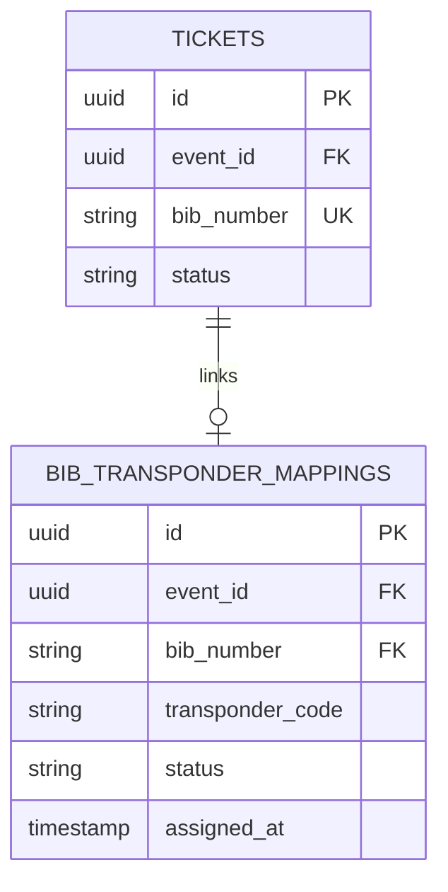

# BIB Allocation and Transponder Management

In competitive endurance racing, the BIB number is the central identifier connecting physical race bibs, participant medical profiles, start corral waves, timing transponders, and official race results.

---

## 1. BIB Assignment Models

IvyTicketing supports three distinct BIB allocation methods, tracked via `tickets.bib_assignment_method`:

| Method | Enum | Trigger | Use Case |
| :--- | :--- | :--- | :--- |
| **Automatic Sequential** | `AUTO` | Batch execution via `POST .../tickets/auto-assign-bib` | Bulk assignment of thousands of registered runners prior to race bib printing. |
| **Manual Direct** | `MANUAL` | Individual edit via `PUT .../tickets/{ticketId}/bib` | Elite athletes, celebrity runners, pacers, or sponsor VIPs requesting specific numbers. |
| **Administrative Override** | `OVERRIDE` | Problem desk swap at race expo | Damaged bib replacement or last-minute on-site category changes. |

---

## 2. Category Number Ranges and Prefixes

Organizers configure dedicated number pools per category to avoid collision and facilitate visual corral staging:

```
Full Marathon (42K)   : 1001 - 1999 (Corral A & B)
Half Marathon (21K)   : 2001 - 3999 (Corral C & D)
10K Challenge         : 5001 - 7999 (Corral E)
5K Fun Run            : 9001 - 9999 (Corral F)
```

### Uniqueness and Concurrency Invariant

- **Event-Level Uniqueness**: The database enforces `UNIQUE (event_id, bib_number)` on the `tickets` table. Two participants can never hold the same BIB number within the same event.
- **Race Condition Prevention**: During automated batch assignment, the system locks the category sequence counter in PostgreSQL:
  ```sql
  SELECT current_bib
  FROM category_bib_sequences
  WHERE category_id = :category_id
  FOR UPDATE;
  ```
  This ensures concurrent assigner jobs never generate duplicate BIB numbers or create orphan gaps.

---

## 3. RFID Transponder Mapping

Modern race timing relies on passive UHF RFID transponders embedded in race bibs or active timing chips attached to athlete ankles.

IvyTicketing links BIB numbers to timing hardware via the `bib_transponder_mappings` table:



### Transponder Lifecycle

- `ACTIVE`: The current primary timing chip mapped to the runner.
- `REPLACED`: The original chip was damaged, lost at expo, or failed reader test; a replacement transponder was issued.
- `REVOKED`: The chip was reported stolen or invalidated.
