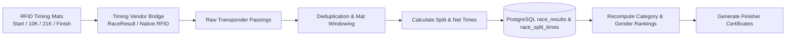
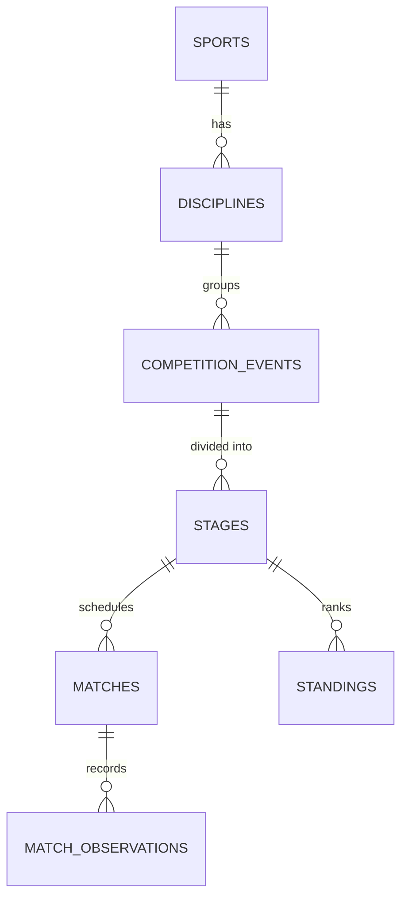

# Multi-Sport Competition Engine

IvyTicketing features a dual-layer competition architecture: a high-throughput **Endurance Timing Engine** for road races, and a generic **Multi-Sport Tournament Engine** for multi-discipline sporting events.

---

## 1. Endurance Timing Engine (Road Races & Triathlons)

The endurance timing engine processes timing mat passings, computes official split times, ranks athletes, and issues finisher certificates.

### Key Timing Metrics

- **Gun Time (Gross Time)**: Measured from the official starter's horn/gun to the athlete crossing the finish line. Determines official podium standings in accordance with World Athletics rules.
- **Chip Time (Net Time)**: Measured from the athlete crossing the start line mat to the finish line mat. Refers to the personal time printed on finisher certificates.
- **Split Times**: Intermediate timing checkpoints (e.g. 5K, 10K, Halfway, 30K) used to calculate pacing splits and detect course cutting.

### Timing Statuses (`race_results.status`)

- `FINISHED`: Crossed start and finish line within valid time limits with all required intermediate splits.
- `DNF` (Did Not Finish): Athlete started the race but did not cross the finish mat or dropped out.
- `DNS` (Did Not Start): Registered participant who never triggered the start line mat.
- `DSQ` (Disqualified): Rule violation (e.g. missed checkpoint, pacing vehicle, unverified proxy bib).
- `OTL` (Over Time Limit): Athlete finished the course after the official race cutoff time.
- `PENDING_REVIEW`: Split anomaly flagged for referee adjudication.

---

## 2. Generic Multi-Sport Tournament Engine

For events extending beyond linear road races, IvyTicketing implements a normalized tournament hierarchy capable of managing team sports, racket sports, cycling tours, and track-and-field meets.

### Hierarchy Entities

1. **Sport & Discipline**: Top-level definitions (e.g., Badminton -> Singles/Doubles, Athletics -> 100m Sprint, Cycling -> Road Race/Criterium).
2. **Competition Stage**: Represents an operational phase within an event:
   - `single_race`: Mass-participation endurance event.
   - `group_round_robin`: Pool play where all competitors face each other.
   - `single_elimination`: Knockout tournament bracket.
   - `double_elimination`: Championship bracket with repechage/consolation pool.
   - `heats`: Qualification rounds with time/position progression into semifinals/finals.
   - `peloton_stage`: Multi-day road cycling tour with cumulative general classification.
3. **Competition Match**: A scheduled fixture between participants (or a single heat).
4. **Participant Entries & Rosters**: Supports `INDIVIDUAL`, `TEAM`, `PAIR`, `RELAY`, and `SQUAD` formations with player status tracking (`ACTIVE`, `SUBSTITUTE`, `INJURED`, `SUSPENDED`).

---

## 3. Specialized Scoring Resolvers

The competition engine delegates score calculations to pluggable sport-specific resolvers:

### BWF Badminton Scoring Resolver
- Implements official Badminton World Federation (BWF) rally point scoring:
  - Best of 3 games to 21 points.
  - Deuce requirement: At 20-all, a side must lead by 2 points.
  - Hard cap at 30 points (at 29-all, the side scoring the 30th point wins the game).

### Cycling Stage & Peloton Resolver
- Enforces road cycling time gap rules:
  - Bunch finish: Riders finishing within the same peloton cluster receive identical finish times.
  - General Classification (GC): Cumulative times across stages with sprint/mountain bonus deductions.
