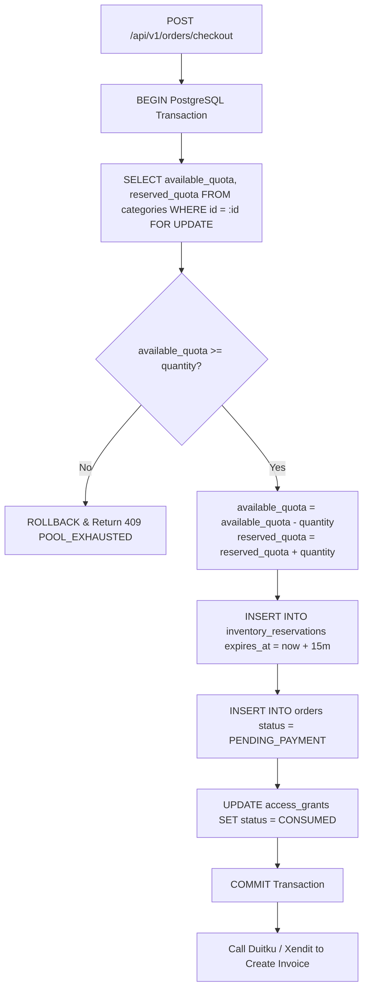
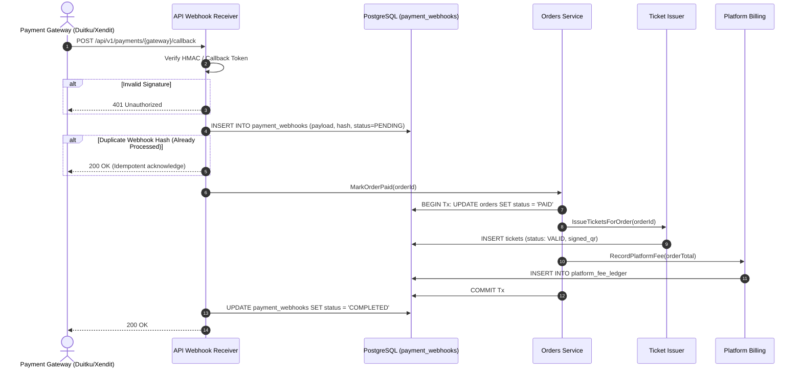

# Orders, Inventory, and Payment Processing

This document explains how IvyTicketing handles the commercial transaction pipeline: cart checkout, PostgreSQL inventory locking, gateway payment dispatch, webhook verification, and fee ledgering.

---

## 1. Inventory Reservation Mechanics

IvyTicketing guarantees zero overselling under concurrent load through strict database row locking.



### The 15-Minute Reservation Hold

- When a checkout order is created, the inventory is immediately decremented from `available_quota` and incremented in `reserved_quota`.
- An `inventory_reservations` record is inserted with an expiration timestamp calculated as `NOW() + ORDER_EXPIRATION` (default: 15 minutes).
- If the participant fails to pay within 15 minutes, the background daemon [`expire_orders`](file:///root/ivyticketing/services/api/cmd/worker/main.go) executes:
  ```sql
  UPDATE categories
  SET available_quota = available_quota + r.quantity,
      reserved_quota = reserved_quota - r.quantity
  FROM inventory_reservations r
  WHERE r.order_id = orders.id
    AND orders.status = 'PENDING_PAYMENT'
    AND r.expires_at < NOW();

  UPDATE orders
  SET status = 'EXPIRED'
  WHERE status = 'PENDING_PAYMENT'
    AND expires_at < NOW();
  ```

---

## 2. Payment Gateway Integrations

IvyTicketing integrates with Southeast Asia's leading payment gateways via a unified driver interface:

### Supported Gateways

| Gateway Provider | Environments | Payment Channels | Verification Method |
| :--- | :--- | :--- | :--- |
| **Duitku** | Sandbox, Production | QRIS, Virtual Accounts (BCA, Mandiri, BNI, BRI), Credit Cards, E-Wallets (GoPay, OVO, ShopeePay) | SHA256 / MD5 signature hash matching `merchantCode + amount + merchantOrderId + apiKey` |
| **Xendit** | Sandbox, Production | XenPlatform, QRIS, Virtual Accounts, Credit Cards, PayLater | Static header verification matching `x-callback-token` |

---

## 3. Webhook Processing and Idempotency

Payment gateways communicate transaction settlements via asynchronous HTTP POST webhooks. IvyTicketing treats webhooks with strict cryptographic verification and idempotency defense.



### Idempotency Invariants

- **Deduplication Hash**: Every inbound webhook payload is hashed (SHA-256) and recorded in `payment_webhooks`.
- **Zero Double-Issuance**: If network retries cause a gateway to deliver the same payment notification 5 times, subsequent requests encounter an existing processed record and immediately return `200 OK` without triggering duplicate ticket creation or fee calculations.
