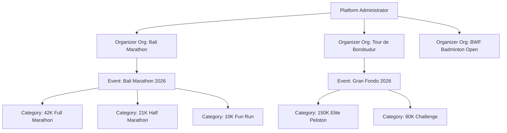
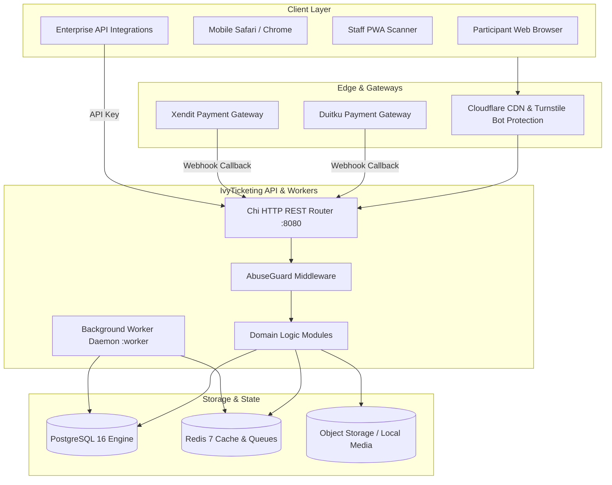

# IvyTicketing Platform Overview

IvyTicketing is an enterprise multi-tenant ticketing, registration, and competition management platform engineered for endurance sporting events (marathons, triathlons, cycling gran fondos) and multi-sport tournaments.

The platform is designed to withstand extreme "war-day" traffic surges when thousands of participants compete for limited race slots within seconds.

---

## 1. Core Architectural Pillars

IvyTicketing is architected around four non-negotiable guarantees:

1. **Admission is Strictly Separated from Allocation**:
   Queue admission or ballot selection gives a participant permission to enter the checkout flow. Only an atomic database transaction at checkout holds inventory (`inventory_reservations`). A queue position alone never guarantees a ticket.
2. **Zero Overselling Invariant**:
   Inventory capacity is authoritative in PostgreSQL. All reservation attempts execute with row-level locks (`SELECT ... FOR UPDATE`) or atomic SQL decrement constraints, ensuring that ticket issuance never exceeds authorized capacity under concurrent load.
3. **Sub-Millisecond Traffic Throttling**:
   Sudden traffic spikes are absorbed by an in-memory Redis layer utilizing sorted sets (`ZSET`) and sliding-window rate limiters. Database connections are shielded from high-concurrency polling through 2-second Redis status caching and fail-open fallbacks.
4. **Cryptographic Anti-Tampering**:
   Digital tickets are issued with HMAC-SHA256 signed payloads embedding ticket UUID, event UUID, participant UUID, and issuance timestamp. Tickets can be verified offline by gate scanners with zero chance of forgery.

---

## 2. Multi-Tenancy Architecture

IvyTicketing supports true multi-tenancy where multiple independent race organizers operate on shared compute and database infrastructure:

### Tenancy Isolation Guarantees

- **Data Partitioning**: All events, categories, orders, forms, racepack slots, and results reference an `organization_id`.
- **BOLA Defense**: Handlers verify that every sub-resource belongs to the targeted organization before executing queries.
- **Independent Customization**: Organizations configure their own branding colors, logos, email templates, payment credentials (Duitku/Xendit), and custom subdomains.

---

## 3. The Major System Actors

| Actor | Access Scope | Primary Actions |
| :--- | :--- | :--- |
| **Participant** | Self-Service | Browse public events, enter queues, apply for ballots, reserve tickets, pay invoices, download HMAC QR tickets, authorize racepack proxies, view race timing and certificates. |
| **Organizer Staff** | Organization Workspace | Create events, design registration forms, monitor real-time war queues, execute ballot draws, assign sequential BIBs, staff expo pickup desks, adjudicate tournament matches, export CSV reports. |
| **Gate / Expo Scanner** | Assigned Events | Scan participant ticket QR codes using the offline-capable PWA scanner, verify check-in status, record racepack handoffs, flag problem desk tickets. |
| **Platform Administrator** | System-Wide | Manage global tenant accounts, inspect the live war-room telemetry dashboard, configure anti-bot challenge thresholds, review platform fee ledgers. |

---

## 4. High-Level System Architecture

