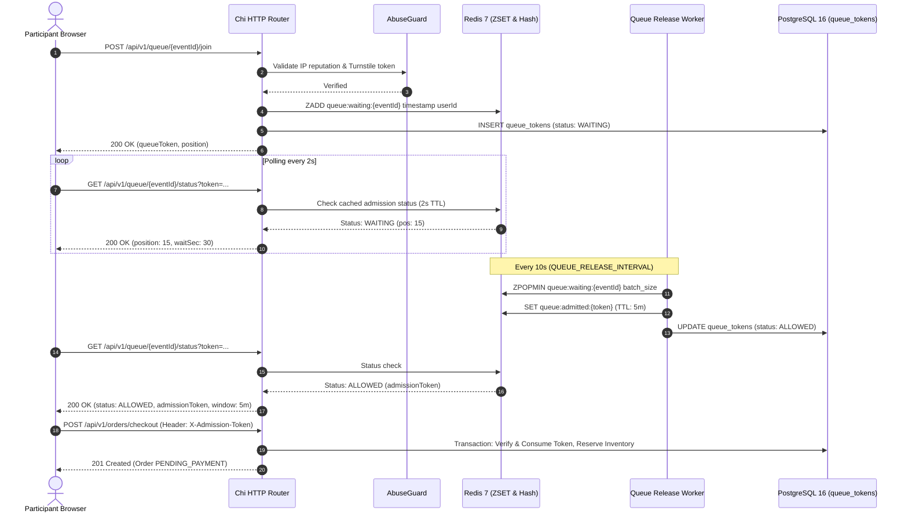

# High-Traffic War Queue Architecture

The IvyTicketing War Queue is an in-memory traffic control and admission engine built on Redis 7 and Go. It is designed to handle surges of 10,000+ concurrent participants competing for limited event slots.

---

## 1. Architectural Design

---

## 2. Redis Data Structures

The queue engine uses four Redis primitives for sub-millisecond operations:

1. **Waiting Pool Sorted Set (`queue:waiting:{eventId}`)**:
   - `ZADD` with millisecond timestamp as score.
   - Preserves strict FIFO arrival order.
2. **Active Admission Hash (`queue:admitted:{token}`)**:
   - Stored with an automatic 5-minute TTL (`QUEUE_CHECKOUT_WINDOW`).
   - Grants single-use permission to call checkout routes.
3. **Queue Status Cache (`queue:status:{token}`)**:
   - Cached queue calculation with a 2-second TTL.
   - Prevents database connection exhaustion during mass polling.
4. **Abuse Sliding Window (`ratelimit:queue:{ip}`)**:
   - Tracks join and poll frequency to throttle bot activity.

---

## 3. High-Concurrency Safeguards

### Status Caching
When 10,000 users poll the server every 2 seconds, the system receives 5,000 requests per second. Querying PostgreSQL for position calculations at this volume would quickly saturate connection pools.
IvyTicketing serves queue position and status directly from Redis cache keys (`queue:status:{token}`). Database queries are executed only on cache misses.

### Polling Rate Limiting
Clients that violate the 2-second polling interval receive an immediate `429 TOO_MANY_REQUESTS` before touching domain logic.

### Admission Token Expiration
When a participant is popped from the queue, their admission token is valid for 5 minutes (`QUEUE_CHECKOUT_WINDOW`). If the participant fails to submit a checkout order within this window:
- The token transitions to `EXPIRED`.
- The slot is freed for the next waiting participant in the release cycle.

---

## 4. Organizer Queue Operations

Organizers with `queue.manage` permissions have real-time operational controls:

- **Live Queue Inspection**: Monitor waiting pool depth, admitted user count, and average checkout conversion rate.
- **Dynamic Rate Throttling**: Modify release rate on the fly (e.g. reduce from 200/min to 50/min if upstream payment gateways report high latency).
- **Emergency Pause / Resume**: Instantly freeze queue admissions with `POST /api/v1/organizations/{orgId}/events/{eventId}/queue/pause`. Existing checkout orders remain valid, but no new users are admitted.
