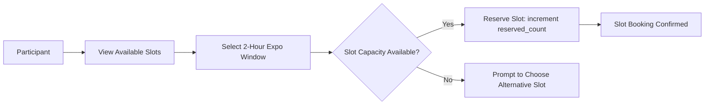
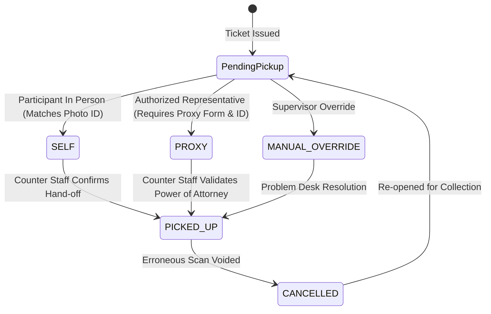

# Racepack Collection and Expo Logistics

Racepack Collection (RPC) is the physical distribution phase where participants collect their race bib, timing chip, event jersey, and sponsor gear prior to race day.

IvyTicketing provides a complete digital logistics suite to manage expo crowds, prevent duplicate collection, and resolve athlete disputes.

---

## 1. Pickup Slot Booking

To prevent bottlenecking and long queues at race expos, IvyTicketing implements time-slot reservations:

- **Capacity Enforcement**: Configured via `racepack_pickup_slots` with PostgreSQL check constraint:
  `CHECK (reserved_count <= capacity)`.
- **Atomic Booking**: Slots are reserved atomically with optimistic concurrency control or row-level locking.

---

## 2. Collection Methods and Verification

At the expo counter, staff scan the participant's QR code. IvyTicketing supports three collection modes recorded in `racepack_pickup_records`:

### Self Collection (`SELF`)
- Participant presents their digital ticket QR code.
- Counter staff verifies that the name on the digital ticket matches the participant's government-issued photo ID (KTP / Passport / Driver's License).

### Proxy Collection (`PROXY`)
- Participants unable to attend expo can delegate collection through the portal via `POST /api/v1/racepack/tickets/{ticketId}/authorize-proxy`.
- Required fields stored in the audit record:
  - Proxy Full Name
  - Proxy National Identity Number (KTP / Passport)
  - Scanned Power of Attorney / Authorization Letter
- Expo staff inspects the proxy's physical ID against the recorded authorization before confirming pickup.

---

## 3. The Problem Desk

When discrepancies occur at the expo counters, staff escalate the ticket to the **Problem Desk** rather than delaying the main queue lines.

Common triggers:
- Mismatched t-shirt size inventory.
- Damaged or missing timing transponder.
- Disputed proxy authorization letter.
- Medical category downgrades requested by runner.

### Problem Case Lifecycle

Cases are tracked in `racepack_problem_cases`:

1. `OPEN`: Opened by counter staff with category, issue description, and ticket UUID.
2. `UNDER_REVIEW`: Supervisor assigned to investigate transaction history or locate replacement bibs.
3. `ESCALATED`: Referred to the race director or medical team.
4. `RESOLVED`: Resolution documented (e.g. issued replacement BIB via `tickets.assign_bib` override), case closed, and racepack handed over.
