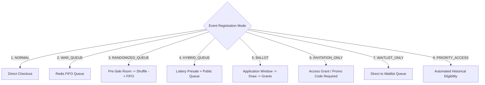

# Registration Modes and Admission Control

IvyTicketing provides a flexible, robust admission engine supporting 8 registration mechanisms tailored to different event scale and participant demand profiles.

---

## 1. Admission Control vs Business Allocation

A fundamental design principle of IvyTicketing is the strict separation between **Admission** and **Allocation**:

```
Client Request
      ↓
Rate Limiter (Redis sliding window)
      ↓
Admission Control (Queue Token / Ballot Win / Priority Grant)
      ↓
Registration Eligibility Check (Window, Category Quota, Account Status)
      ↓
Inventory Reservation (PostgreSQL Row-Lock hold for 15 minutes)
      ↓
Order Draft (PENDING_PAYMENT)
      ↓
Payment Processing (Duitku / Xendit Gateway)
      ↓
Ticket & BIB Allocation (VALID Ticket with signed HMAC QR)
```

### The Separation Invariant

- **Queue admission does NOT consume inventory**: Being popped from the queue or holding a queue token only gives a participant an `admissionToken` allowing them to call the checkout route. It does not deduct from category capacity.
- **Queue position does NOT guarantee a ticket**: If 1,000 participants queue for 200 slots, participants are admitted in batches. The first 200 participants to complete checkout claim the slots; later participants will encounter `POOL_EXHAUSTED`.
- **Payment cannot bypass inventory**: Gateway webhooks only mark an order `PAID` if the order was already successfully held with an active reservation.
- **Ballot selection issues an Admission Grant, not an immediate ticket**: A ballot winner receives an `access_grant` with a payment deadline. Only when they pay is a ticket issued.

---

## 2. The 8 Supported Registration Modes

Registration mode is configured at the event level via `events.registration_mode` and enforced by [registrationmod.Gate](file:///root/ivyticketing/services/api/internal/modules/registration/gate.go).



### 1. NORMAL (Direct Registration)
- **Use Case**: Club races, community runs, and events with moderate traffic.
- **Behavior**: Participants proceed directly from event category selection to checkout.
- **Admission**: Automatic. No queue token or grant required.
- **Throttling**: Protected against scraping and brute force by standard IP rate limiting.

### 2. WAR_QUEUE (FIFO High-Traffic Queue)
- **Use Case**: Major commercial marathons where tickets sell out in minutes.
- **Behavior**: All checkout requests require an active `X-Admission-Token`. Participants enter a Redis sorted set queue.
- **Release Worker**: Pops waiting users at the configured release rate (e.g. 100 users per 10 seconds) and grants a 5-minute checkout window (`QUEUE_CHECKOUT_WINDOW`).
- **User Feedback**: Participant frontend polls status every 2 seconds (cached in Redis) showing live queue position and estimated wait time.

### 3. RANDOMIZED_QUEUE (Pre-Sale Fair Shuffle)
- **Use Case**: Eliminates advantages from ultra-low latency fiber connections or automated bots arriving milliseconds before sale opening.
- **Behavior**:
  - Before `saleStartAt`, participants join a `PRESALE` pool.
  - Exactly at `saleStartAt`, the system executes a cryptographically secure random shuffle of all presale participants.
  - Participants arriving *after* `saleStartAt` are appended to the back of the queue in standard FIFO order.

### 4. HYBRID_QUEUE (Tiered Presale Lottery + Public Queue)
- **Use Case**: Major events with sponsor quotas, alumni presales, and a general public sale.
- **Behavior**: Combines an early randomized presale allocation window with a secondary FIFO queue for general public entry.

### 5. BALLOT (Oversubscribed Lottery)
- **Use Case**: World-major marathons where applicant demand exceeds capacity by 5x-20x.
- **Behavior**:
  - Application window opens for several days/weeks.
  - Participants submit an entry with zero upfront payment (`APPLIED`).
  - Organizer triggers random lottery draw.
  - Winners are issued single-use access grants with a payment deadline (typically 24 to 72 hours).
  - Unpaid winner slots lapse automatically via the `ballot_winner_expirer` background worker, promoting waitlisted applicants.

### 6. INVITATION_ONLY (Closed / Private Access)
- **Use Case**: Elite athlete fields, corporate sponsors, media, and charity partners.
- **Behavior**: Checkout is completely locked to the public. Requires a validated single-use access grant UUID or authorized invitation code issued by the organizer.

### 7. WAITLIST_ONLY (Sold-Out Standby)
- **Use Case**: Full capacity events collecting backup registrations.
- **Behavior**: Direct registration is closed. Entrants join a chronological waitlist pool without payment. When existing orders are cancelled or refunded, the organizer or automated worker releases slots to waitlist entrants in sequence.

### 8. PRIORITY_ACCESS (Loyalty and Qualification Rules)
- **Use Case**: Boston-qualifier style time standards or past participant loyalty presales.
- **Behavior**: Evaluates participant profile metadata (verified past finisher times, previous year order IDs, membership numbers) against rules. Eligible users receive automatic access grants during the priority presale window.

---

## 3. Dynamic Mode Transitions and Safety Guarantees

Organizers may modify registration modes via `PUT /api/v1/organizations/{orgId}/events/{eventId}/registration/mode`.

### Safety Guarantees During Mode Changes

1. **Existing Orders are Immune**:
   A mode change never cancels existing `DRAFT`, `PENDING_PAYMENT`, or `PAID` orders.
2. **Active Reservations are Preserved**:
   A 15-minute inventory hold already committed to the database remains valid until payment or expiration, regardless of mode changes.
3. **Queue Evacuation Safety**:
   Transitioning from `WAR_QUEUE` to `NORMAL` clears queue requirements for new requests while allowing currently admitted users to complete checkout normally.
4. **Ballot Result Protection**:
   Changing mode after a ballot draw has run does not alter winner statuses or revoke issued access grants.
