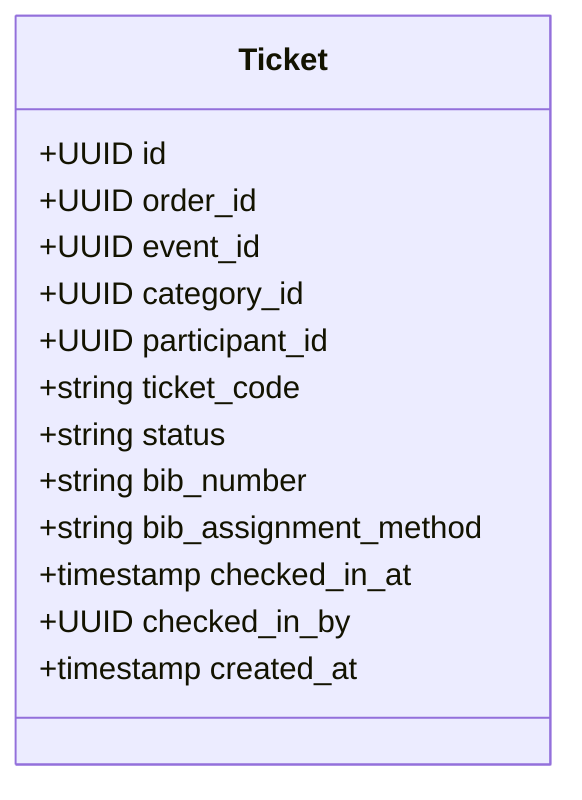

# Digital Tickets and HMAC QR Architecture

IvyTicketing issues cryptographically secure, tamper-proof digital tickets designed for high-throughput entry control at race expos and start line corrals.

---

## 1. Ticket Issuance and Data Structure

When an order transitions to `PAID`, the [ticket issuer](file:///root/ivyticketing/services/api/internal/modules/tickets/service.go) creates one ticket record per item in the order.



### Ticket Statuses

- `VALID`: Active ticket eligible for racepack collection and gate entry.
- `USED`: Ticket has been checked in by a scanner device at an entry gate or racepack counter. Double-entry is strictly rejected.
- `CANCELLED`: Ticket invalidated due to order refund or administrative disqualification.

---

## 2. Cryptographic HMAC QR Signature

To prevent counterfeit tickets, screenshot manipulation, and unauthorized pass duplication, each ticket is rendered as an HMAC-SHA256 signed QR code.

### Token Construction

The QR code payload is serialized as a versioned, dot-separated or Base64URL-encoded envelope:

```
v1.<ticket_id>.<event_id>.<participant_id>.<issued_at>.<hmac_signature>
```

- **Algorithm**: HMAC-SHA256
- **Secret Key**: `cfg.TicketQRSecret` (loaded from environment)
- **Signature Input**: `ticket_id + ":" + event_id + ":" + participant_id + ":" + issued_at`

### Verification Process

When a gate scanner scans the QR code:
1. **Format Validation**: The token is unpacked and verified against version `v1`.
2. **Signature Authenticity**: The scanner or backend recomputes the HMAC-SHA256 signature using the secret key. If the signature does not match, the scan fails immediately with `422 QR_SIGNATURE_INVALID`.
3. **Database Check-in**:
   ```sql
   UPDATE tickets
   SET status = 'USED',
       checked_in_at = NOW(),
       checked_in_by = :staff_user_id
   WHERE id = :ticket_id
     AND event_id = :event_id
     AND status = 'VALID'
   RETURNING id;
   ```
   If 0 rows are returned, the system checks whether the ticket was already used (`409 ALREADY_CHECKED_IN`) or cancelled (`409 TICKET_CANCELLED`).

---

## 3. Offline Verification Capability

Endurance races frequently take place in remote geographic locations (forest reserves, mountain trails, island courses) where cellular connectivity is intermittent or unavailable.

- **Offline-First PWA Scanner**: The IvyTicketing scanner is built as a progressive web application (PWA) with client-side caching.
- **Local Key Verification**: The scanner downloads the event signature verification key prior to deployment.
- **Offline Ledger**: When operating offline, the scanner validates the cryptographic HMAC signature locally and stores the check-in event in IndexedDB. Once cellular or Wi-Fi connectivity is restored, the client pushes the synchronization queue to the central server.
