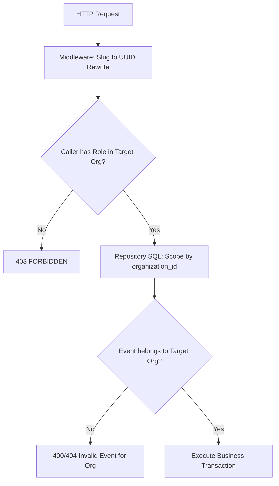

# Security Architecture and Threat Mitigation Model

This document outlines the security architecture, threat model, and defense-in-depth controls implemented across IvyTicketing.

---

## 1. Authentication and Session Security

- **JWT Signing**: Access tokens are signed using HMAC-SHA256 with `JWT_SECRET`. Tokens embed `user_id` and `is_platform_admin`.
- **Short-Lived Access Tokens**: Access tokens expire after 15 minutes (`ACCESS_TOKEN_TTL`), minimizing the window of vulnerability if a token is intercepted.
- **Secure Refresh Cookies**: Refresh tokens (7-day validity) are delivered via `HttpOnly`, `SameSite=Strict`, `Secure` cookies, preventing cross-site scripting (XSS) extraction.
- **Password Storage**: Passwords are hashed using bcrypt with an adaptive cost factor (`cost = 12`). Raw passwords are never logged or stored.

---

## 2. Multi-Tenant Isolation and BOLA Defense

Broken Object Level Authorization (BOLA / IDOR) is one of the highest risks in multi-tenant SaaS. IvyTicketing eliminates cross-tenant access via three layers:



1. **Scoped URL Routing**: Organizer routes follow `/api/v1/organizations/{orgId}/events/{eventId}/...`.
2. **Slug-to-UUID Rewrite**: [`resolveEventAndOrgParams`](file:///root/ivyticketing/services/api/internal/platform/middleware/authz.go#L54) validates that the requested `eventId` belongs to the `orgId` specified in the route before invoking the handler.
3. **Database-Level Ownership Constraints**: SQL updates and selects always include `WHERE organization_id = :org_id` clauses.

---

## 3. Cryptographic Ticket Verification

Digital ticket forgery is eliminated through HMAC-SHA256 signatures:

- **Secret Separation**: The `TICKET_QR_SECRET` is completely decoupled from user authentication secrets and never exposed to client applications.
- **Tamper-Evident QR Payloads**: The payload embeds `ticket_id`, `event_id`, `participant_id`, and `issued_at`. Modifying any byte immediately invalidates the signature.
- **Double-Entry Prevention**: Gate check-in routes enforce database state transitions (`VALID` -> `USED`) with row-level locks, rejecting screenshot passes.

---

## 4. Payment Gateway Webhook Security

Inbound payment callbacks represent high-risk financial integration points:

- **Cryptographic Signature Verification**:
  - **Duitku**: Verifies MD5/SHA256 checksum matching `merchantCode + amount + merchantOrderId + apiKey`.
  - **Xendit**: Verifies `x-callback-token` header against configured secret.
- **Replay and Idempotency Protection**: Every callback payload is SHA-256 hashed and recorded in `payment_webhooks`. Duplicate delivery attempts return `200 OK` without triggering secondary ticket issuance.

---

## 5. Anti-Bot and Abuse Mitigation (`AbuseGuard`)

The platform employs a multi-tiered abuse mitigation engine:

1. **Cloudflare Turnstile**: Integrates privacy-preserving CAPTCHA challenges during high-traffic queue joins and user registrations.
2. **IP Reputation Scoring**: Tracks abnormal velocity, credential stuffing, and user-agent anomalies. Clients exceeding score 10 receive Turnstile challenges; score 25 results in an immediate 403 deny.
3. **Queue Hoarding Limits**: Restricts each user account to a maximum of 5 concurrent queue entries (`MAX_ACTIVE_QUEUE_PER_USER`).
4. **CIDR Blocklists**: In-memory IP filtering rejects malicious IP ranges before route handlers execute.

---

## 6. Immutable Security Audit Logging

All privileged actions (lottery draws, manual BIB overrides, refunds, staff role assignments, queue parameter changes) are recorded in the `audit_logs` table:

```sql
CREATE TABLE audit_logs (
    id UUID PRIMARY KEY DEFAULT gen_random_uuid(),
    organization_id UUID,
    actor_id UUID NOT NULL,
    actor_ip INET,
    action TEXT NOT NULL,
    target_type TEXT NOT NULL,
    target_id UUID,
    payload JSONB,
    created_at TIMESTAMPTZ NOT NULL DEFAULT NOW()
);
```
The audit log is append-only; update and delete privileges are revoked in production databases.
