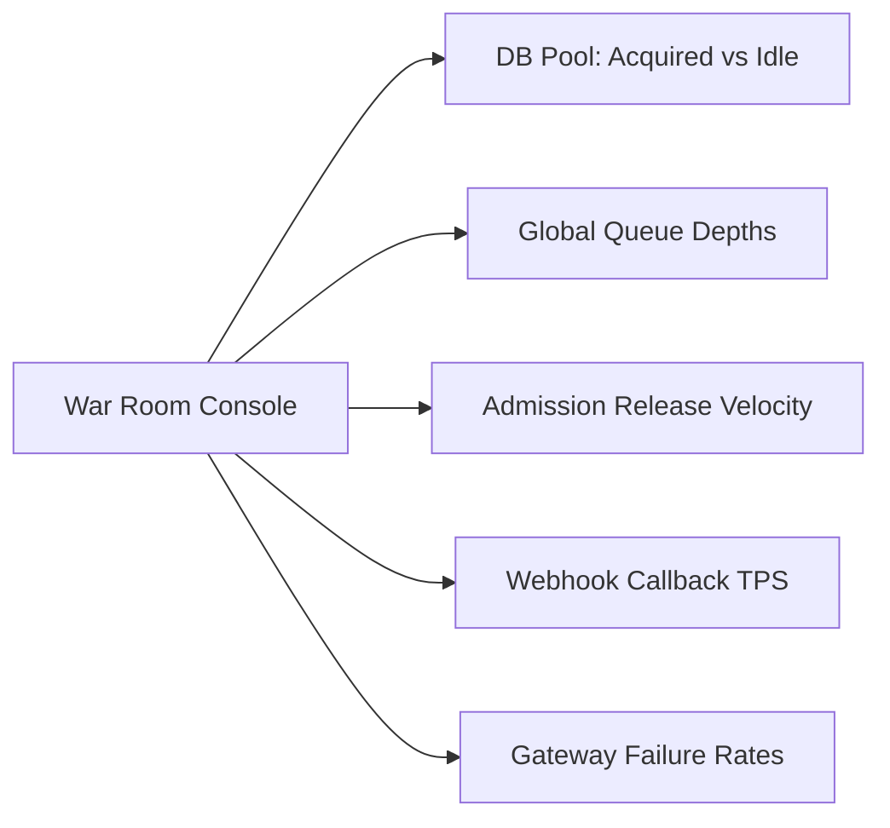

# Platform Administrator Operations Guide

This manual details global administrative procedures, multi-tenant governance, system observability, abuse mitigation, and billing management for IvyTicketing platform administrators.

---

## 1. Tenant Governance and Provisioning

Platform administrators oversee all organizer tenants through the Admin Console (`/admin`):

### Creating a New Tenant Organization
1. Navigate to **Admin** -> **Organizations** -> **New Organization**.
2. Fill in the organization details:
   - **Name**: Official entity or race organizer name.
   - **Slug**: Canonical URL slug used in routes and subdomains.
   - **Contact Email**: Primary administrative email.
3. Assign a **Subscription Package**:
   - `Starter`: 0% platform fee, standard ticketing.
   - `Professional`: 2.5% platform fee, war queue, automated BIB allocation.
   - `Enterprise`: Negotiated fee, custom domain, white-labeling, full competition engine, dedicated API keys.
4. Set **Subscription Status** to `ACTIVE`.

### Custom Domain Verification
When an Enterprise organizer connects a custom domain (e.g. `register.balimarathon.com`):
1. The system generates a cryptographic DNS TXT verification token.
2. The organizer adds the TXT record to their DNS zone:
   `_ivyticketing-challenge.register.balimarathon.com TXT "ivyticketing-verify=<token>"`
3. Admin clicks **Verify Domain** (or automated worker validates).
4. Upon DNS resolution match, status updates from `PENDING` to `VERIFIED`.

---

## 2. Real-Time War Room Telemetry

The platform provides a consolidated telemetry endpoint at `GET /api/v1/admin/warroom` and dashboard at `/admin/warroom`:

### Key Metrics to Monitor During Major Launches

- **Database Pool Saturation**:
  - `db_connections_acquired`: Active queries currently executing.
  - `db_connections_idle`: Free connections in `pgxpool`.
  - *Alert threshold*: If acquired connections exceed 85% of total pool for >30 seconds, scale up connection pool or throttle queue release rates.
- **Queue Backpressure**:
  - Total tokens in `WAITING` state across Redis sorted sets.
  - Average wait time in seconds.
- **Payment Processing Latency**:
  - Gateway callback response time. If Duitku or Xendit callback latency exceeds 5 seconds, notify payment partner operations.

---

## 3. Abuse Prevention and Bot Mitigation

The [AbuseGuard module](file:///root/ivyticketing/services/api/internal/modules/abuse/guard.go) protects the platform against automated scalping bots, credential stuffing, and volumetric spam.

### Tuning Global Reputation Rules
Navigate to **Admin** -> **Abuse & Bot Guard**:

1. **Reputation Challenge Threshold** (default: `10`):
   - Requests exhibiting suspicious characteristics (abnormal headers, rapid IP switching, velocity spikes) accumulate reputation penalty points.
   - Once a client's score exceeds 10, the client is challenged with a Cloudflare Turnstile CAPTCHA.
2. **Reputation Deny Threshold** (default: `25`):
   - Clients with a score of 25 or higher receive an immediate `403 FORBIDDEN` response.
3. **Max Active Queues Per User** (default: `5`):
   - Prevents an individual user account from holding queue positions across multiple browser windows or devices.

### Manual IP and Range Blocking
1. Open the **Blocklist Management** tab.
2. Add single IP addresses or CIDR subnets (e.g., `198.51.100.0/24`).
3. Set block duration: `1 Hour`, `24 Hours`, or `Permanent`.
4. Block rules are cached in Redis and evaluated in memory before route handlers execute.

---

## 4. Platform Invoicing and Fee Collection

IvyTicketing automatically calculates platform service fees for every paid order via the `platform_fee_ledger`:

1. **Fee Calculation**:
   - Order total multiplied by subscription `fee_bps` (basis points, where 100 bps = 1.0%).
   - Recorded atomically upon order transition to `PAID`.
2. **Monthly Invoice Generation**:
   - On the 1st of each month, the billing worker aggregates ledger entries into monthly `platform_invoices`.
   - Invoices include platform fees and fixed monthly subscription package charges.
3. **Tracking Settlement**:
   - Admins can inspect invoice payment statuses (`DRAFT`, `ISSUED`, `PAID`, `VOID`) and reconcile against organizer payout requests.

---

## 5. System Incidents and Status Page Management

Maintain public trust during service degradation through the built-in Status Page (`/api/v1/status`):

1. **Component Health**:
   - Configure components: `Public Website`, `Registration Engine`, `Payment Gateways`, `Queue Service`, `Scanner API`.
   - Status states: `OPERATIONAL`, `DEGRADED`, `DOWN`.
2. **Publishing Incident Reports**:
   - Click **Create Incident**.
   - Set **Impact**: `NONE`, `MINOR`, `MAJOR`, `CRITICAL`.
   - Post timestamped updates with statuses:
     - `INVESTIGATING`
     - `IDENTIFIED`
     - `MONITORING`
     - `RESOLVED`
   - Updates are immediately visible to participants on the public status page.
