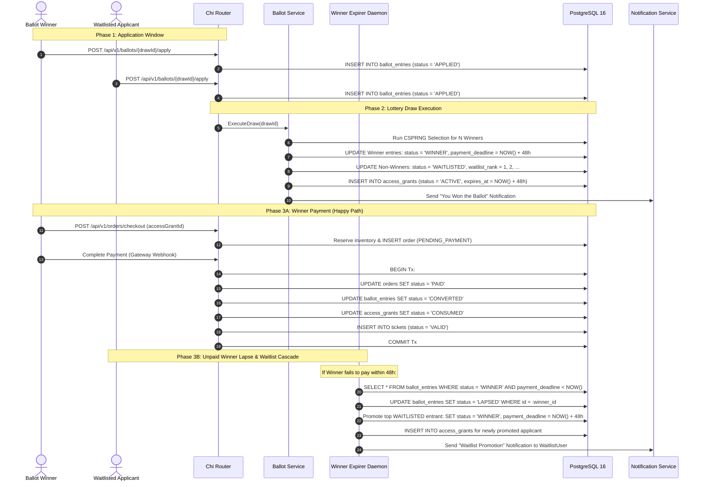

# Ballot Registration and Winner Conversion Workflow (`BALLOT` Mode)

This workflow details the complete lifecycle of a lottery-based registration: application, random draw, winner notification, checkout conversion, and the automated waitlist promotion fallback.

---

## 1. Sequence Diagram

---

## 2. Invariants and Safety Guarantees

1. **Transactional Conversion**: The ballot winner status is updated to `CONVERTED` within the exact same database transaction that marks the order `PAID` and issues the digital ticket.
2. **Double-Allocation Prevention**: When an unpaid winner's entry lapses, their unused access grant is marked `EXPIRED` immediately before the promoted waitlisted participant's new grant is created.
3. **Auditability**: Every draw execution and promotion event generates an append-only entry in `audit_logs`.
