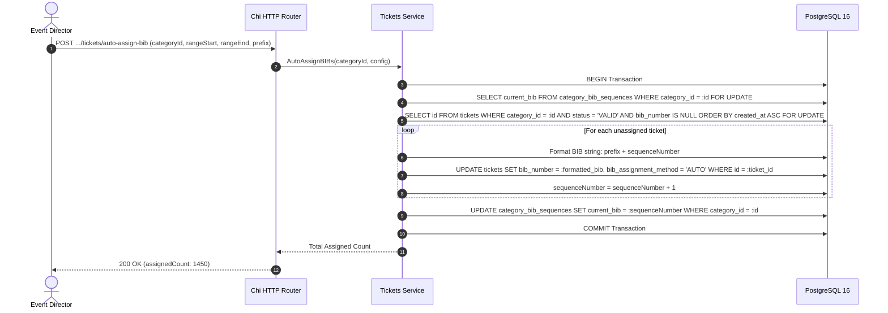

# BIB Allocation and Transponder Assignment Workflow

This workflow documents the batch sequential assignment of BIB numbers to paid participants, manual VIP overrides, and RFID transponder mapping.

---

## 1. Sequence Diagram: Batch Sequential Auto-Assignment



---

## 2. Manual VIP and Elite BIB Override

For elite runners, pacers, or on-site expo replacements:

1. Organizer sends `PUT /api/v1/organizations/{orgId}/events/{eventId}/tickets/{ticketId}/bib` with payload `{"bibNumber": "ELITE-01"}`.
2. The service executes an event-wide uniqueness check:
   ```sql
   SELECT id FROM tickets
   WHERE event_id = :event_id
     AND bib_number = 'ELITE-01'
     AND id != :ticket_id
     AND status != 'CANCELLED';
   ```
3. If an existing ticket holds that number, returns `409 BIB_CONFLICT`.
4. Otherwise updates `tickets.bib_number = 'ELITE-01'` and `bib_assignment_method = 'MANUAL'`.
5. An audit log event is recorded with the previous and new BIB numbers.
