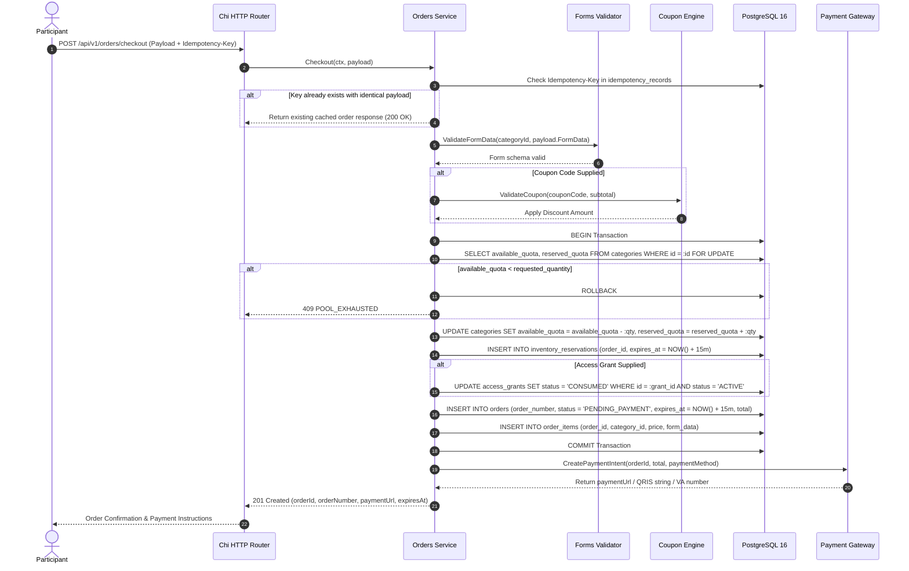

# Checkout and Inventory Reservation Workflow

The checkout workflow handles cart conversion, form validation, row-level PostgreSQL inventory locking, coupon calculation, and payment intent initialization.

---

## 1. Sequence Diagram

---

## 2. Invariants and Safety Guarantees

1. **Row-Level Locking Invariant**: Inventory decrement is protected by `SELECT ... FOR UPDATE` inside the database transaction. Parallel checkouts queue at the row lock, making overselling mathematically impossible.
2. **Idempotent Retries**: If network issues cause the client to retry the checkout request with the same `Idempotency-Key`, the system returns the existing order rather than reserving duplicate inventory.
3. **Strict 15-Minute Deadline**: The order record and inventory hold share identical expiration timestamps (`NOW() + 15m`).
