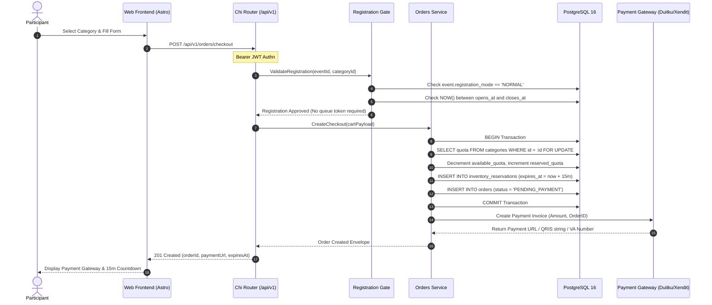

# Direct Registration Workflow (`NORMAL` Mode)

This workflow describes the direct registration flow used for standard community races and events operating under the `NORMAL` registration mode without virtual queue waiting rooms.

---

## 1. Sequence Diagram

---

## 2. Invariants and Safety Guarantees

1. **Immediate Quota Hold**: As soon as the checkout request succeeds, the ticket is reserved for 15 minutes. No other participant can claim this inventory during this window.
2. **Atomic Failure Handling**: If the category is sold out, the transaction rolls back cleanly and returns `409 POOL_EXHAUSTED` with zero impact on database state.
3. **Automatic Abandonment Expiration**: If the participant closes their browser and never pays, the `expire_orders` background worker restores the quota exactly 15 minutes later.
