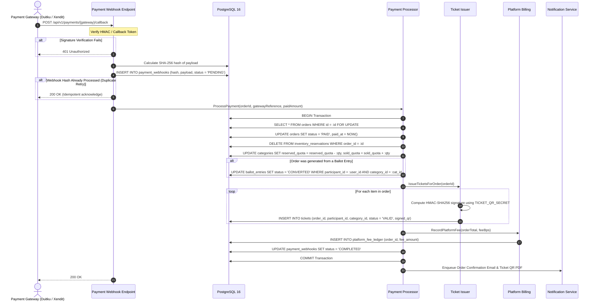

# Payment Webhook Processing and Ticket Issuance Workflow

This workflow traces the inbound payment notification pipeline from payment gateway callback to cryptographic ticket issuance and platform fee accounting.

---

## 1. Sequence Diagram

---

## 2. Invariants and Safety Guarantees

1. **Strict Idempotency**: Payment gateways frequently retry callbacks when responses take longer than a few hundred milliseconds. IvyTicketing guarantees that duplicate callbacks never issue duplicate tickets or double-deduct fees.
2. **Atomic Inventory State Shift**: The transition of quota from `reserved_quota` to permanent `sold_quota` executes inside the same transaction as the ticket issuance.
3. **Ballot Conversion Consistency**: If the purchaser won their slot through a ballot draw, their ballot entry transitions from `WINNER` to `CONVERTED` simultaneously, permanently preventing the `ballot_winner_expirer` daemon from lapsing the entry.
