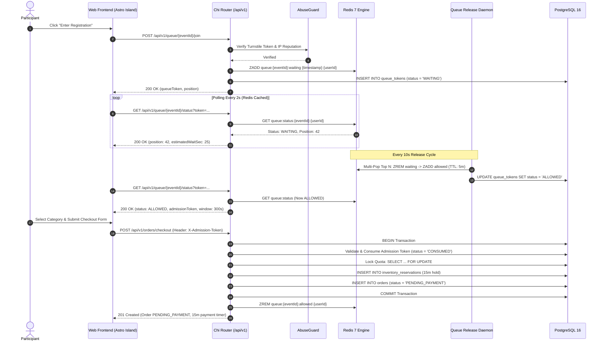

# High-Traffic Queue Registration Workflow (`WAR_QUEUE` Mode)

This workflow traces the admission, waiting room, release, and checkout sequence for high-demand ticket sales operating under the `WAR_QUEUE` mode.

---

## 1. Sequence Diagram

---

## 2. Invariants and Safety Guarantees

1. **Admission Token Single-Use Guarantee**: An admission token can only be consumed once. Attempting to use the same token for multiple checkout calls returns `403 ADMISSION_EXPIRED`.
2. **5-Minute Checkout Expiration**: If a participant is released into the checkout room but takes longer than 5 minutes to submit their details, the admission token expires automatically and the slot is released to waiting participants.
3. **Sub-Millisecond Polling Defense**: Queue status requests are cached in Redis with a 2-second TTL. The database is never queried during the waiting room polling loop.
