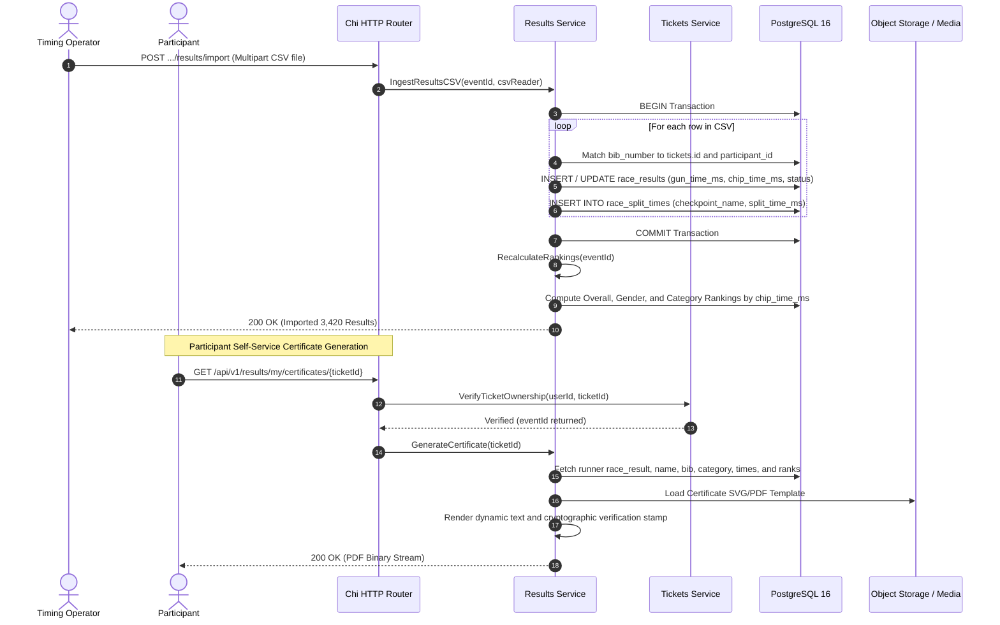

# Race Results Processing and Finisher Certificate Workflow

This workflow traces the ingestion of official timing data, category ranking calculations, and participant self-service certificate generation.

---

## 1. Sequence Diagram

---

## 2. Invariants and Safety Guarantees

1. **Ticket Ownership Gate**: Participants cannot access or generate certificates for other athletes. Handlers enforce ownership by calling [`ticketsSvc.GetTicketForUser`](file:///root/ivyticketing/services/api/internal/app/server.go#L314) before accessing results.
2. **Deterministic Ranking**: Rankings are calculated server-side based strictly on chip time for category and age group placements, and gun time for official podium placements.
3. **Audit Trail**: Every results file import or ranking adjustment is permanently logged in `audit_logs` with the operator's user ID and file checksum.
